# ControlNet-v1.0

##  基本概念


- **Stable Diffusion** 模型下添加额外条件（Edge Map, Sketch, Depth Info, Segmentation Map, Human Pose, Normal Maps）做受控图像生成的方法，主要思路在SD模型中为添加与UNet结构类似的ControlNet以学习额外条件信息，映射进参数固定的SD模型中，完成条件生成。本质上是在原始的SD输入端补充了一个feature map作控制条件，以控制SD的生成方向。
- **阅读paper**的记录视频：[阅读](https://pan.baidu.com/s/1W9N_u3cdKmR-pGfyGqG9Yg?pwd=35uo)[paper的记录视频](https://pan.baidu.com/s/1W9N_u3cdKmR-pGfyGqG9Yg?pwd=35uo)
- **github地址**：[lllyasviel/ControlNet: Let us control diffusion models! (github.com)](https://github.com/lllyasviel/ControlNet)
- **paper地址**：[[2302.05543\] Adding Conditional Control to Text-to-Image Diffusion Models (arxiv.org)](https://arxiv.org/abs/2302.05543)
- **核心点**
  - 使用Stable Diffusion并冻结其参数，同时copy一份SDEncoder的副本，这个副本的参数是可训练的，且不会在小规模数据集上过拟合，同时不丢失预训练大模型上的泛化能力。
  - 零卷积 ：即初始权重和bias都是零的卷积。在副本中每层增加一个零卷积与原始网络的对应层相连。在第一步训练中，神经网络块的可训练副本和锁定副本的所有输入和输出都是一致的，随后第二步的更新，才缓慢更新梯度重新赋值weights。

```python
def zero_module(module):
    """
    Zero out the parameters of a module and return it.
    """
    for p in module.parameters():
        p.detach().zero_()
    return module
 
 zero_module(conv_nd(dims, model_channels, out_channels, 3, padding=1)
```

​		模型结构如下图。

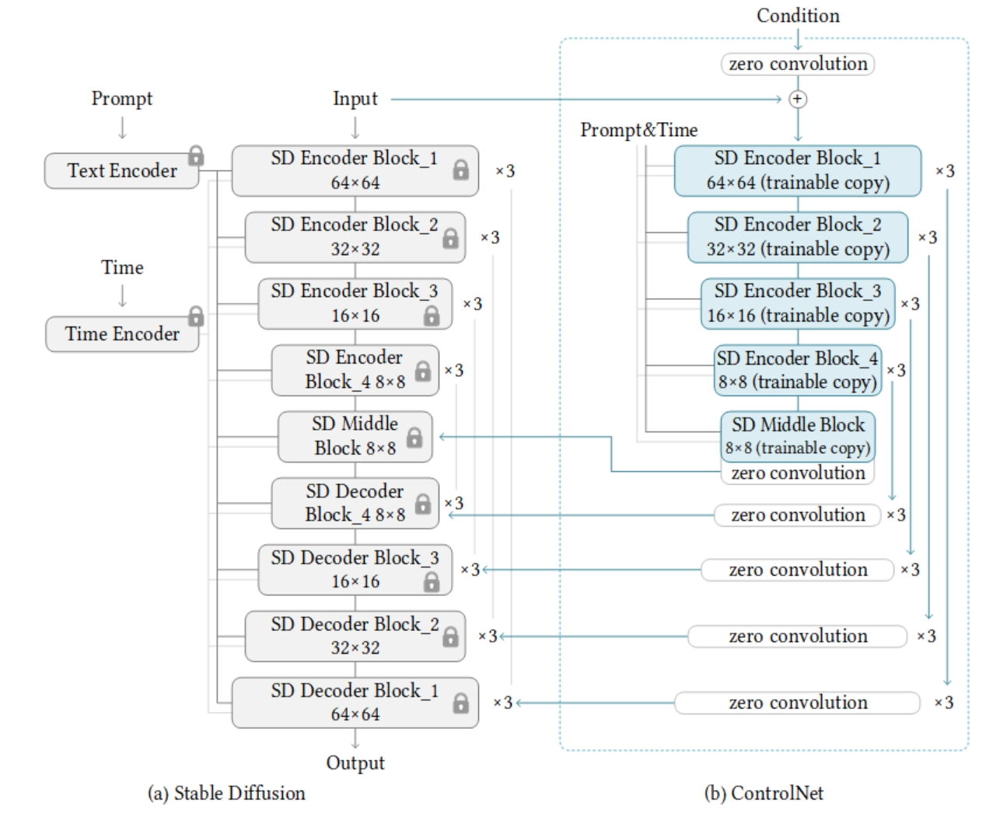


## 功能/应用场景

### 提取线稿、硬边缘检测（原画设计师）

- - 原理Canny通过使用边缘检测器创建高对比度区域的轮廓来检测输入图像。线条可以捕捉到非常详细的信息，但如果图像背景中有一些物体，它很可能会检测到不需要的物体。所以背景中物体越少效果越好。

  - ##### 模型

    | 主模型                                                       | 预处理模型 | 预处理模型结构 |
    | :----------------------------------------------------------- | :--------- | :------------- |
    | [models/control_sd15_canny.pth · lllyasviel/ControlNet at main (huggingface.co)](https://huggingface.co/lllyasviel/ControlNet/blob/main/models/control_sd15_canny.pth) | /          | /              |

  - 训练训练用随机阈值从互联网上获得3M的边缘-图像-caption数据对。该模型使用Nvidia A100 80G进行600个gpu小时的训练。使用的基础模型是Stable Diffusion 1.5。此外，对上述Canny边缘数据集按图像分辨率进行排序，并采样1k、10k、50k、500k样本的子集。使用相同的实验设置来测试数据集规模的影响。

  - 示例


### 建筑设计、直线检测（建筑风格设计师）

- 通过 ControlNet 的 MLSD（Mobile Line Segment Detection） 模型提取建筑的线条结构和几何形状，构建出建筑线框（可提取参考图线条，或者手绘线条），再配合提示词和建筑/室内设计风格模型来生成图像。

- ##### 模型

  | 主模型                                                       | 预处理模型                                                   | 预处理模型paper                                              |
  | :----------------------------------------------------------- | :----------------------------------------------------------- | :----------------------------------------------------------- |
  | [models/control_sd15_mlsd.pth · lllyasviel/ControlNet at main (huggingface.co)](https://huggingface.co/lllyasviel/ControlNet/blob/main/models/control_sd15_mlsd.pth) | [annotator/ckpts/mlsd_large_512_fp32.pth · lllyasviel/ControlNet at main (huggingface.co)](https://huggingface.co/lllyasviel/ControlNet/blob/main/annotator/ckpts/mlsd_large_512_fp32.pth)[annotator/ckpts/mlsd_tiny_512_fp32.pth · lllyasviel/ControlNet at main (huggingface.co)](https://huggingface.co/lllyasviel/ControlNet/blob/main/annotator/ckpts/mlsd_tiny_512_fp32.pth) | [Towards Light-weight and Real-time Line Segment Detection](https://arxiv.org/abs/2106.00186) |

- 使用基于深度学习的Hough变换方法对Places2数据集检测线图，并且使用BLIP生成caption。由此，得到了600k对的边缘-图像-caption。使用前面的Canny模型作为初始化checkpoint，并使用Nvidia A100 80G用150个gpu小时训练。

- 示例


### 精细、软边界检测（重新着色和风格化）

- 原理Hed（**Holistically-Nested Edge Detection**）可以在物体周围创建清晰和精细的边界，输出类似于Canny，但减少了噪声和更柔软的边缘。它的有效性在于能够捕捉复杂的细节和轮廓，同时保留细节特征(面部表情、头发、手指等)。Hed预处理器可用于修改图像的风格和颜色。

- ##### 模型

  | 主模型                                                       | 预处理模型                                                   | 预处理模型paper                                              |
  | :----------------------------------------------------------- | :----------------------------------------------------------- | :----------------------------------------------------------- |
  | [models/control_sd15_hed.pth · lllyasviel/ControlNet at main (huggingface.co)](https://huggingface.co/lllyasviel/ControlNet/blob/main/models/control_sd15_hed.pth) | [annotator/ckpts/network-bsds500.pth · lllyasviel/ControlNet at main (huggingface.co)](https://huggingface.co/lllyasviel/ControlNet/blob/main/annotator/ckpts/network-bsds500.pth) | [Holistically-Nested Edge Detection](https://arxiv.org/abs/1504.06375) |

- 训练从互联网上获取3M的边缘-图像-caption的数据对，使用Nvidia A100 80G进行300个gpu小时训练。基础模型是Stable Diffusion 1.5。

- 示例

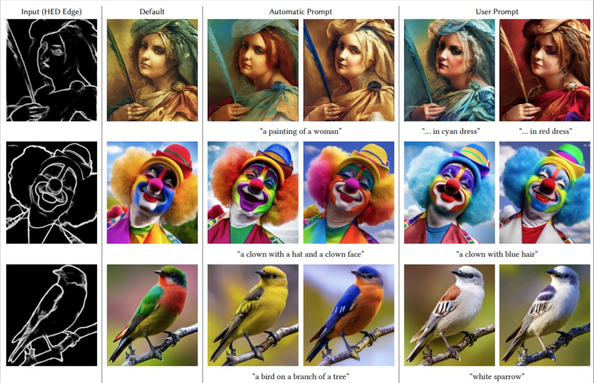

### 人体姿态

- 通过 ControlNet 的 Scribble 模型提取涂鸦图（可提取参考图涂鸦，或者手绘涂鸦图），再根据提示词和风格模型对图像进行着色和风格化。Scribble 比 Canny、SoftEdge 和 Lineart 的自由发挥度要更高，也可以用于对手绘稿进行着色和风格处理。

- ##### 模型

  | 主模型                                                       | 预处理模型 | 预处理模型paper |
  | :----------------------------------------------------------- | :--------- | :-------------- |
  | [models/control_sd15_openpose.pth · lllyasviel/ControlNet at main](https://huggingface.co/lllyasviel/ControlNet/blob/main/models/control_sd15_openpose.pth) | /          | /               |

- 从互联网上获得了50万对的涂鸦图像-caption数据对。使用前面的Canny模型作为初始化checkpoint，并使用Nvidia A100 80G用150个gpu小时训练。

- 示例

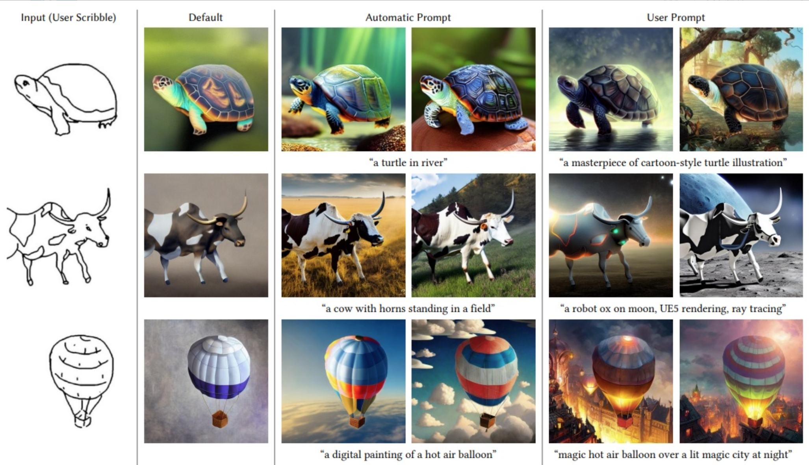

### 草图、涂鸦成图（用户自用）

- 使用基于学习的姿态估计方法在上面的Openpifpaf设置中使用相同的规则从互联网上找到人类。获得了200k个姿势-图像-caption数据对。直接使用人体骨骼的可视化姿态图像作为训练条件。使用Nvidia A100 80G进行300个gpu小时的训练。

- ##### 模型

  | 主模型                                                       | 预处理模型                                                   | 预处理模型paper                                              |
  | :----------------------------------------------------------- | :----------------------------------------------------------- | :----------------------------------------------------------- |
  | [models/control_sd15_openpose.pth · lllyasviel/ControlNet at main (huggingface.co)](https://huggingface.co/lllyasviel/ControlNet/blob/main/models/control_sd15_openpose.pth) | [annotator/ckpts/body_pose_model.pth · lllyasviel/ControlNet at main (huggingface.co)](https://huggingface.co/lllyasviel/ControlNet/blob/main/annotator/ckpts/body_pose_model.pth)<br/>[annotator/ckpts/hand_pose_model.pth · lllyasviel/ControlNet at main (huggingface.co)](https://huggingface.co/lllyasviel/ControlNet/blob/main/annotator/ckpts/hand_pose_model.pth) | [OpenPifPaf: Composite Fields for Semantic Keypoint Detection and Spatio-Temporal Association](https://arxiv.org/abs/2103.02440)[<br/>[OpenPose: Realtime Multi-Person 2D Pose Estimation using Part Affinity Fields](https://arxiv.org/abs/1812.08008g) |

- 使用基于学习的姿态估计方法在上面的Openpifpaf设置中使用相同的规则从互联网上找到人类。获得了200k个姿势-图像-caption数据对。直接使用人体骨骼的可视化姿态图像作为训练条件。使用Nvidia A100 80G进行300个gpu小时的训练。

- 示例


### 深度检测、提取深度结构（CG或游戏美术师）

- 生成输入图像的深度估计。深度通常用于控制图像内物体的空间定位。浅色区域意味着它离用户更近，而深色区域则离用户更远。在大图像时它可能会丢失图像内部的细节(面部表情等)Midas Resolution函数用于增加或减少detectmap中的大小和细节级别。它的级别越高，将使用更多的VRAM，但可以生成更高质量的图像，反之亦然。

- ##### 模型

  | 主模型                                                       | 预处理模型                                                   | 预处理模型paper                  |
  | :----------------------------------------------------------- | :----------------------------------------------------------- | :------------------------------- |
  | [models/control_sd15_depth.pth · lllyasviel/ControlNet at main (huggingface.co)](https://huggingface.co/lllyasviel/ControlNet/blob/main/models/control_sd15_depth.pth) | [annotator/ckpts/dpt_hybrid-midas-501f0c75.pt · lllyasviel/ControlNet at main (huggingface.co)](https://huggingface.co/lllyasviel/ControlNet/blob/main/annotator/ckpts/dpt_hybrid-midas-501f0c75.pt) | https://arxiv.org/abs/1907.01341 |

- 使用Midas从互联网上获取3M的深度-图像-caption数据对。使用Nvidia A100 80G进行500 gpu小时的训练。基础模型是Stable Diffusion 1.5。

- 示例


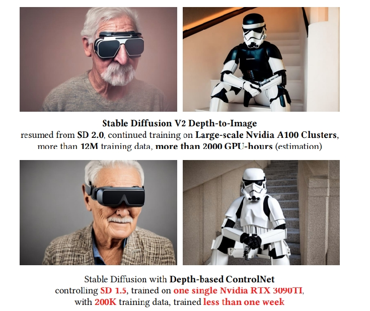

## 模型结构和参数统计

### 模型结构

#### Controlnet-Pipeline

- 模型输入包括Map_input（比如Canny边缘图、Depth-feature等），Prompt、附加Prompt（Added Prompt）、负面Prompt（Negative Prompt）、随机噪声图（Random Input）及Time_step（T）。
- 下图展示整个Pipeline之间的数据Dataflow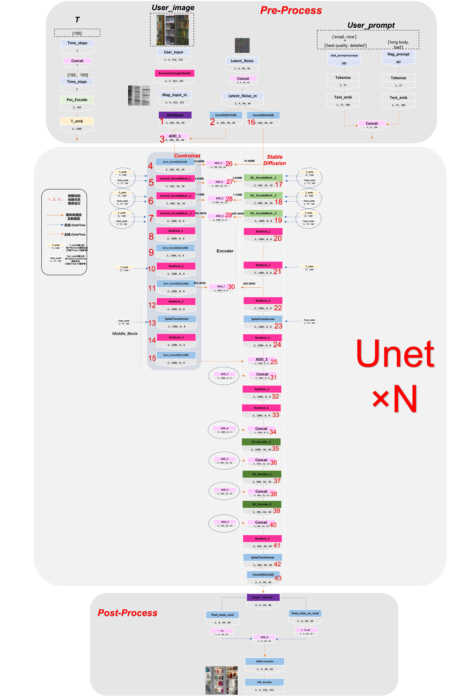

#### ControlLDM

- timesteps经过embedding转换为特征向量送入Stable Diffusion和ControlNet。

- 随机噪声被送入Stable Diffusion；

- 图像的Map经过HintBlock整流，与随机噪声经过整流后的向量相加后送入ControlNet作为image-feature的总输入，该部分即为feature如depth、pose等和原始噪声交互；

- Prompt的Embedding送入Stable Diffusion和ControlNet；

- Stable Diffusion由三个SD_EncoderBlock、两个SD_Encoder、一个SD_MiddleBlock、两个SD_Decoder和三个SD_DecoderBlock组成；

- Stable Diffusion和ControlNet中的ResBlock将上一层的输出和timesteps作为输入；

- Stable Diffusion和ControlNet中的SpatialTransformer将上一层的输出和Prompt Embedding 作为输入；

- ControlNet的结构与Stable Diffusion一致，只是每层后面增加一个零卷积（仅仅是训练第一轮开始为0，一轮后该卷积层参数会更新）,Stable Diffusion的所有参数被冻结不参与训练；

- 加载Controlnet的配置文件cldm_v15.yaml，理清Dataflow时考虑三种方式：

  - Model转onnx后用netron打开，controlnet_model.onnx.png，但onnx支线过于复杂，无法对应module。

  - Model转onnx用onnx_tool 统计，controlnet_model.txt，这样在Dataflow的输入输出上能直接确定，但具体的module相对会难找（可用于辅助对比）。

  - print（Model）+ 打断点。每个module的输入输出打断点，输出该tensor过该module前后的维度，并且print（Model）看该module执行的算子（主要）。

- HintBlock

  - HintBlock的主要功能是在输入的图像Map与其他特征融合前，先提取一波特征并整流，主要是要和latent embedding整流后的特征对齐，HintBlock堆叠了几层卷积，以一个零卷积结尾。

  - 该模块code如下。

```python
self.input_hint_block = TimestepEmbedSequential(
          conv_nd(dims, hint_channels, 16, 3, padding=1),
          nn.SiLU(),
          conv_nd(dims, 16, 16, 3, padding=1),
          nn.SiLU(),
          conv_nd(dims, 16, 32, 3, padding=1, stride=2),
          nn.SiLU(),
          conv_nd(dims, 32, 32, 3, padding=1),
          nn.SiLU(),
          conv_nd(dims, 32, 96, 3, padding=1, stride=2),
          nn.SiLU(),
          conv_nd(dims, 96, 96, 3, padding=1),
          nn.SiLU(),
          conv_nd(dims, 96, 256, 3, padding=1, stride=2),
          nn.SiLU(),
          zero_module(conv_nd(dims, 256, model_channels, 3, padding=1))
      )
```


​		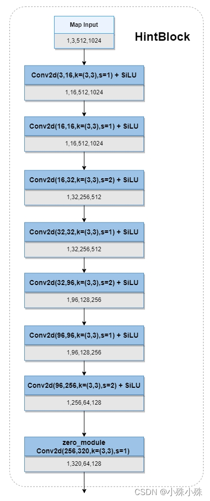

#### ResBlock

- HintBlock的主要功能是在输入的图像Map与其他特征融合前，先提取一波特征并整流，主要是要和latent embedding整流后的特征对齐，HintBlock堆叠了几层卷积，以一个零卷积结尾。

​		

	

#### SpatialTransformer

- SpatialTransformer主要负责融合Prompt Embedding和上一层的输出。主要由两个CrossAttention模块和一个FeedForward模块组成。CrossAttention1将上一个层的输出作为输入，将输入平分成三分，分别经过两个全连接得到K和V，K乘以Q经过Softmax得到一个概率图，让后在于V相乘，本质上是一个Self Attention（因为K-V-Q都是Image Embedding生成，和Prompt-Embedding无关）。CrossAttention2和CrossAttention1的结构一样，不同的是K和V是由Prompt Embedding生成的。经过了两个CrossAttention，图像特征与Prompt Embedding已经融合到一起。

- Q，K，V是linear层生成（或者可选conv2d（k=1*1，code里说linear层计算效率高，但默认选择的是conv2d（k=1*1）），经过CrossAttention后的featrue回加进image feature完成注意。

```python
class CrossAttention(nn.Module):
    def __init__(self, query_dim, context_dim=None, heads=8, dim_head=64, dropout=0.):
        super().__init__()
        inner_dim = dim_head * heads
        context_dim = default(context_dim, query_dim)
 
        self.scale = dim_head ** -0.5
        self.heads = heads
 
        self.to_q = nn.Linear(query_dim, inner_dim, bias=False)
        self.to_k = nn.Linear(context_dim, inner_dim, bias=False)
        self.to_v = nn.Linear(context_dim, inner_dim, bias=False)
 
        self.to_out = nn.Sequential(
            nn.Linear(inner_dim, query_dim),
            nn.Dropout(dropout)
        )
 
    def forward(self, x, context=None, mask=None):
        h = self.heads
 
        q = self.to_q(x)
        context = default(context, x)
        k = self.to_k(context)
        v = self.to_v(context)
 
        q, k, v = map(lambda t: rearrange(t, 'b n (h d) -> (b h) n d', h=h), (q, k, v))
 
        sim = einsum('b i d, b j d -> b i j', q, k) * self.scale
 
        if exists(mask):
            mask = rearrange(mask, 'b ... -> b (...)')
            max_neg_value = -torch.finfo(sim.dtype).max
            mask = repeat(mask, 'b j -> (b h) () j', h=h)
            sim.masked_fill_(~mask, max_neg_value)
 
        # attention, what we cannot get enough of
        attn = sim.softmax(dim=-1)
 
        out = einsum('b i j, b j d -> b i d', attn, v)
        out = rearrange(out, '(b h) n d -> b n (h d)', h=h)
        return self.to_out(out)
 
 
class BasicTransformerBlock(nn.Module):
    def __init__(self, dim, n_heads, d_head, dropout=0., context_dim=None, gated_ff=True, checkpoint=True):
        super().__init__()
        self.attn1 = CrossAttention(query_dim=dim, heads=n_heads, dim_head=d_head, dropout=dropout)  # is a self-attention
        self.ff = FeedForward(dim, dropout=dropout, glu=gated_ff)
        self.attn2 = CrossAttention(query_dim=dim, context_dim=context_dim,
                                    heads=n_heads, dim_head=d_head, dropout=dropout)  # is self-attn if context is none
        self.norm1 = nn.LayerNorm(dim)
        self.norm2 = nn.LayerNorm(dim)
        self.norm3 = nn.LayerNorm(dim)
        self.checkpoint = checkpoint
 
    def forward(self, x, context=None):
        return checkpoint(self._forward, (x, context), self.parameters(), self.checkpoint)
 
    def _forward(self, x, context=None):
        x = self.attn1(self.norm1(x)) + x
        x = self.attn2(self.norm2(x), context=context) + x
        x = self.ff(self.norm3(x)) + x
        return x
 
 
class SpatialTransformer(nn.Module):
    """
    Transformer block for image-like data.
    First, project the input (aka embedding)
    and reshape to b, t, d.
    Then apply standard transformer action.
    Finally, reshape to image
    """
    def __init__(self, in_channels, n_heads, d_head,
                 depth=1, dropout=0., context_dim=None):
        super().__init__()
        self.in_channels = in_channels
        inner_dim = n_heads * d_head
        self.norm = Normalize(in_channels)
 
        self.proj_in = nn.Conv2d(in_channels,
                                 inner_dim,
                                 kernel_size=1,
                                 stride=1,
                                 padding=0)
 
        self.transformer_blocks = nn.ModuleList(
            [BasicTransformerBlock(inner_dim, n_heads, d_head, dropout=dropout, context_dim=context_dim)
                for d in range(depth)]
        )
 
        self.proj_out = zero_module(nn.Conv2d(inner_dim,
                                              in_channels,
                                              kernel_size=1,
                                              stride=1,
                                              padding=0))
 
    def forward(self, x, context=None):
        # note: if no context is given, cross-attention defaults to self-attention
        b, c, h, w = x.shape
        x_in = x
        x = self.norm(x)
        x = self.proj_in(x)
        x = rearrange(x, 'b c h w -> b (h w) c')
        for block in self.transformer_blocks:
            x = block(x, context=context)
        x = rearrange(x, 'b (h w) c -> b c h w', h=h, w=w)
        x = self.proj_out(x)
        return x + x_in
```


#### SD_Encoder Block

- SD_Encoder Block是Stable Diffusion编码阶段的组成单元，是编码阶段的模块，主要是ResBlock和SpatialTransformer的堆叠，实现了timestep、hint Map、和PromptEmbedding的特征融合，同时进行下采样，增加特征图的通道数。
- 该部分就是被Controlnet直接copy的SD模块。
- 该模块code如下。

```
for level, mult in enumerate(channel_mult):
        for nr in range(self.num_res_blocks[level]):
            layers = [
                ResBlock(
                    ch,
                    time_embed_dim,
                    dropout,
                    out_channels=mult * model_channels,
                    dims=dims,
                    use_checkpoint=use_checkpoint,
                    use_scale_shift_norm=use_scale_shift_norm,
                )
            ]
            ch = mult * model_channels
            if ds in attention_resolutions:
                if num_head_channels == -1:
                    dim_head = ch // num_heads
                else:
                    num_heads = ch // num_head_channels
                    dim_head = num_head_channels
                if legacy:
                    #num_heads = 1
                    dim_head = ch // num_heads if use_spatial_transformer else num_head_channels
                if exists(disable_self_attentions):
                    disabled_sa = disable_self_attentions[level]
                else:
                    disabled_sa = False
 
                if not exists(num_attention_blocks) or nr < num_attention_blocks[level]:
                    layers.append(
                        AttentionBlock(
                            ch,
                            use_checkpoint=use_checkpoint,
                            num_heads=num_heads,
                            num_head_channels=dim_head,
                            use_new_attention_order=use_new_attention_order,
                        ) if not use_spatial_transformer else SpatialTransformer(
                            ch, num_heads, dim_head, depth=transformer_depth, context_dim=context_dim,
                            disable_self_attn=disabled_sa, use_linear=use_linear_in_transformer,
                            use_checkpoint=use_checkpoint
                        )
                    )
            self.input_blocks.append(TimestepEmbedSequential(*layers))
            self._feature_size += ch
            input_block_chans.append(ch)
        if level != len(channel_mult) - 1:
            out_ch = ch
            self.input_blocks.append(
                TimestepEmbedSequential(
                    ResBlock(
                        ch,
                        time_embed_dim,
                        dropout,
                        out_channels=out_ch,
                        dims=dims,
                        use_checkpoint=use_checkpoint,
                        use_scale_shift_norm=use_scale_shift_norm,
                        down=True,
                    )
                    if resblock_updown
                    else Downsample(
                        ch, conv_resample, dims=dims, out_channels=out_ch
                    )
                )
            )
            ch = out_ch
            input_block_chans.append(ch)
            ds *= 2
            self._feature_size += ch
 
    if num_head_channels == -1:
        dim_head = ch // num_heads
    else:
        num_heads = ch // num_head_channels
        dim_head = num_head_channels
    if legacy:
        #num_heads = 1
        dim_head = ch // num_heads if use_spatial_transformer else num_head_channels
    self.middle_block = TimestepEmbedSequential(
        ResBlock(
            ch,
            time_embed_dim,
            dropout,
            dims=dims,
            use_checkpoint=use_checkpoint,
            use_scale_shift_norm=use_scale_shift_norm,
        ),
        AttentionBlock(
            ch,
            use_checkpoint=use_checkpoint,
            num_heads=num_heads,
            num_head_channels=dim_head,
            use_new_attention_order=use_new_attention_order,
        ) if not use_spatial_transformer else SpatialTransformer(  # always uses a self-attn
                        ch, num_heads, dim_head, depth=transformer_depth, context_dim=context_dim,
                        disable_self_attn=disable_middle_self_attn, use_linear=use_linear_in_transformer,
                        use_checkpoint=use_checkpoint
                    ),
        ResBlock(
            ch,
            time_embed_dim,
            dropout,
            dims=dims,
            use_checkpoint=use_checkpoint,
            use_scale_shift_norm=use_scale_shift_norm,
        ),
    )
    self._feature_size += ch
```

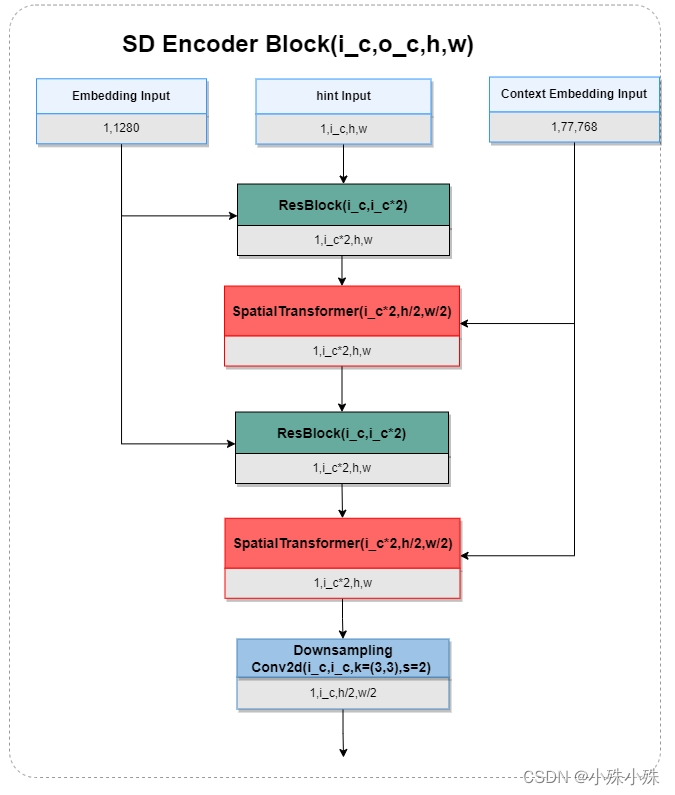

#### SD_Decoder

- Decoder主要是做上采样，是解码阶段的组成单元，主要是ResBlock和SpatialTransformer的堆叠，实现了timestep、hint Map、和PromptEmbedding的特征融合，同时进行上采样。
- 该模块code如下。

```python
self.output_blocks = nn.ModuleList([])
       for level, mult in list(enumerate(channel_mult))[::-1]:
           for i in range(self.num_res_blocks[level] + 1):
               ich = input_block_chans.pop()
               layers = [
                   ResBlock(
                       ch + ich,
                       time_embed_dim,
                       dropout,
                       out_channels=model_channels * mult,
                       dims=dims,
                       use_checkpoint=use_checkpoint,
                       use_scale_shift_norm=use_scale_shift_norm,
                   )
               ]
               ch = model_channels * mult
               if ds in attention_resolutions:
                   if num_head_channels == -1:
                       dim_head = ch // num_heads
                   else:
                       num_heads = ch // num_head_channels
                       dim_head = num_head_channels
                   if legacy:
                       #num_heads = 1
                       dim_head = ch // num_heads if use_spatial_transformer else num_head_channels
                   if exists(disable_self_attentions):
                       disabled_sa = disable_self_attentions[level]
                   else:
                       disabled_sa = False
 
                   if not exists(num_attention_blocks) or i < num_attention_blocks[level]:
                       layers.append(
                           AttentionBlock(
                               ch,
                               use_checkpoint=use_checkpoint,
                               num_heads=num_heads_upsample,
                               num_head_channels=dim_head,
                               use_new_attention_order=use_new_attention_order,
                           ) if not use_spatial_transformer else SpatialTransformer(
                               ch, num_heads, dim_head, depth=transformer_depth, context_dim=context_dim,
                               disable_self_attn=disabled_sa, use_linear=use_linear_in_transformer,
                               use_checkpoint=use_checkpoint
                           )
                       )
               if level and i == self.num_res_blocks[level]:
                   out_ch = ch
                   layers.append(
                       ResBlock(
                           ch,
                           time_embed_dim,
                           dropout,
                           out_channels=out_ch,
                           dims=dims,
                           use_checkpoint=use_checkpoint,
                           use_scale_shift_norm=use_scale_shift_norm,
                           up=True,
                       )
                       if resblock_updown
                       else Upsample(ch, conv_resample, dims=dims, out_channels=out_ch)
                   )
                   ds //= 2
               self.output_blocks.append(TimestepEmbedSequential(*layers))
               self._feature_size += ch
 
       self.out = nn.Sequential(
           normalization(ch),
           nn.SiLU(),
           zero_module(conv_nd(dims, model_channels, out_channels, 3, padding=1)),
       )
       if self.predict_codebook_ids:
           self.id_predictor = nn.Sequential(
           normalization(ch),
           conv_nd(dims, model_channels, n_embed, 1),
           #nn.LogSoftmax(dim=1)  # change to cross_entropy and produce non-normalized logits
       )
```

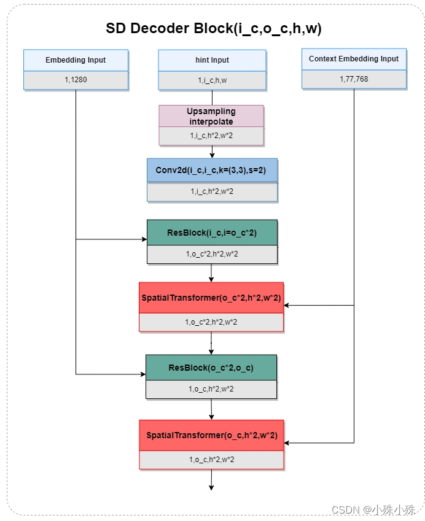

#### Controlnet_Encode Block

- 该模块辅助SD_Encode Block，并在每个Spatial Transformer后补一个零卷积层，将ResBlock堆叠两次后在末端，再补一个零卷积层。
- 该模块code如下。

```python
for level, mult in enumerate(channel_mult):
           for nr in range(self.num_res_blocks[level]):
               layers = [
                   ResBlock(
                       ch,
                       time_embed_dim,
                       dropout,
                       out_channels=mult * model_channels,
                       dims=dims,
                       use_checkpoint=use_checkpoint,
                       use_scale_shift_norm=use_scale_shift_norm,
                   )
               ]
               ch = mult * model_channels
               if ds in attention_resolutions:
                   if num_head_channels == -1:
                       dim_head = ch // num_heads
                   else:
                       num_heads = ch // num_head_channels
                       dim_head = num_head_channels
                   if legacy:
                       # num_heads = 1
                       dim_head = ch // num_heads if use_spatial_transformer else num_head_channels
                   if exists(disable_self_attentions):
                       disabled_sa = disable_self_attentions[level]
                   else:
                       disabled_sa = False
 
                   if not exists(num_attention_blocks) or nr < num_attention_blocks[level]:
                       layers.append(
                           AttentionBlock(
                               ch,
                               use_checkpoint=use_checkpoint,
                               num_heads=num_heads,
                               num_head_channels=dim_head,
                               use_new_attention_order=use_new_attention_order,
                           ) if not use_spatial_transformer else SpatialTransformer(
                               ch, num_heads, dim_head, depth=transformer_depth, context_dim=context_dim,
                               disable_self_attn=disabled_sa, use_linear=use_linear_in_transformer,
                               use_checkpoint=use_checkpoint
                           )
                       )
               self.input_blocks.append(TimestepEmbedSequential(*layers))
               self.zero_convs.append(self.make_zero_conv(ch))
               self._feature_size += ch
               input_block_chans.append(ch)
           if level != len(channel_mult) - 1:
               out_ch = ch
               self.input_blocks.append(
                   TimestepEmbedSequential(
                       ResBlock(
                           ch,
                           time_embed_dim,
                           dropout,
                           out_channels=out_ch,
                           dims=dims,
                           use_checkpoint=use_checkpoint,
                           use_scale_shift_norm=use_scale_shift_norm,
                           down=True,
                       )
                       if resblock_updown
                       else Downsample(
                           ch, conv_resample, dims=dims, out_channels=out_ch
                       )
                   )
               )
               ch = out_ch
               input_block_chans.append(ch)
               self.zero_convs.append(self.make_zero_conv(ch))
               ds *= 2
               self._feature_size += ch
 
       if num_head_channels == -1:
           dim_head = ch // num_heads
       else:
           num_heads = ch // num_head_channels
           dim_head = num_head_channels
       if legacy:
           # num_heads = 1
           dim_head = ch // num_heads if use_spatial_transformer else num_head_channels
       self.middle_block = TimestepEmbedSequential(
           ResBlock(
               ch,
               time_embed_dim,
               dropout,
               dims=dims,
               use_checkpoint=use_checkpoint,
               use_scale_shift_norm=use_scale_shift_norm,
           ),
           AttentionBlock(
               ch,
               use_checkpoint=use_checkpoint,
               num_heads=num_heads,
               num_head_channels=dim_head,
               use_new_attention_order=use_new_attention_order,
           ) if not use_spatial_transformer else SpatialTransformer(  # always uses a self-attn
               ch, num_heads, dim_head, depth=transformer_depth, context_dim=context_dim,
               disable_self_attn=disable_middle_self_attn, use_linear=use_linear_in_transformer,
               use_checkpoint=use_checkpoint
           ),
           ResBlock(
               ch,
               time_embed_dim,
               dropout,
               dims=dims,
               use_checkpoint=use_checkpoint,
               use_scale_shift_norm=use_scale_shift_norm,
           ),
       )
       self.middle_block_out = self.make_zero_conv(ch)
```

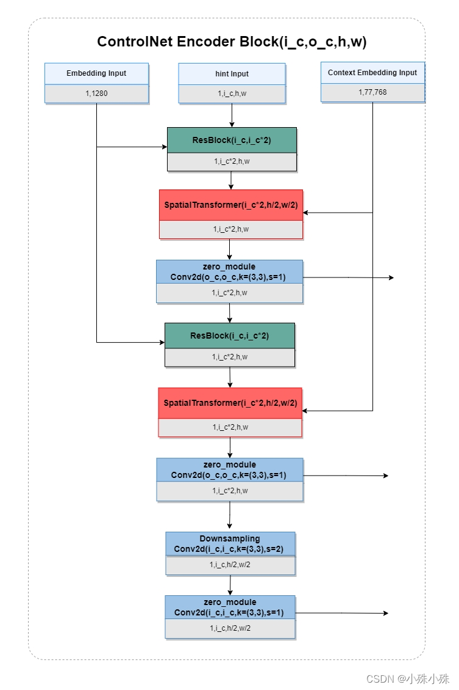

### 模型参数统计

#### 预处理模型(Annotator)

- 预处理模型指的是生成control_condition的模型，如（hand_pose_model）为用户输入image→hand_pose_model→pose_condition，并且将该控制图一并输入主模型进行可控推理。
- 在lllyasviel/ControlNet: Let us control diffusion models! (github.com)指的是Annotator里的模型。

| **应用场景**         | **Input**          | **Model**                 | **Input_size**     | **Output_size**    | **Macs /G** | **Params / M**                                               | **Onnx**                                                     | **Onnx-tool_txt**                                            |
| -------------------- | ------------------ | ------------------------- | ------------------ | ------------------ | ----------- | ------------------------------------------------------------ | ------------------------------------------------------------ | ------------------------------------------------------------ |
| 提取线稿、硬边缘检测 | Canny边缘图->image | /                         | /                  | /                  | /           | /                                                            | **/**                                                        | **/**                                                        |
| 人体姿势             | 人体姿势->image    | body_pose_model           | （1，3，512，512） | (1，19，64，64)    | **263.13**  | **52.31**                                                    | [**bodypose_model.onnx**](https://g.a-bug.org/jihui/aigc_jihui/-/blob/main/diffusion/onnx/bodypose_model.onnx) | [**bodypose_model.txt**](https://cf.b-bug.org/download/attachments/99635503/bodypose_model.txt?version=2&modificationDate=1687747109000&api=v2) |
| 手掌姿势->image      | hand_pose_model    | （1，3，512，512）        | (1，22，64，64)    | **199.74**         | **36.83**   | [**handpose_model.onnx**](https://g.a-bug.org/jihui/aigc_jihui/-/blob/main/diffusion/onnx/handpose_model.onnx) | [**handpose_model.txt**](https://cf.b-bug.org/download/attachments/99635503/handpose_model.txt?version=1&modificationDate=1687747104000&api=v2) |                                                              |
| 深度                 | Depth->image       | dpt_hybrid-midas-501f0c75 | （1，3，512，512） | （1，3，512，512） | ?           | ?                                                            | /                                                            | /                                                            |
| 建筑设计、直线检测   | MLSD->image        | mlsd_large_512_fp32       | (1，4，512，512）  | (1，16，256，256)  | **25.72**   | **1.53**                                                     | [**MobileV2_MLSD_Large.onnx**](https://cf.b-bug.org/download/attachments/99635503/MobileV2_MLSD_Large.onnx?version=1&modificationDate=1687760830000&api=v2) | [**MobileV2_MLSD_Large.txt**](https://cf.b-bug.org/download/attachments/99635503/MobileV2_MLSD_Large.txt?version=1&modificationDate=1687760846000&api=v2) |
| 草图、涂鸦成图       | image              | /                         | /                  | /                  | /           | /                                                            | **/**                                                        | **/**                                                        |
| 精细、软边界检测     | HED边缘图->image   | ControlNetHED_Apache2     | （1，3，512，512） | (1，1，32，32)     | **80.21**   | **14.71**                                                    | [**ControlNetHED_Apache2.onnx**](https://cf.b-bug.org/download/attachments/99635503/ControlNetHED_Apache2.onnx?version=2&modificationDate=1687746720000&api=v2) | [**ControlNetHED_Apache2.txt**](https://cf.b-bug.org/download/attachments/99635503/ControlNetHED_Apache2.txt?version=1&modificationDate=1687699099000&api=v2) |

#### Controlnet_Unet主模型（ControlNet-V1.0）

- 主模型的不同功能上controlnet没有结构上的改变，因此weights的参数和计算力一致。
- 不同的主模型依据不同的control_condition-prompt-image训练对进行训练。

| Input_size          | Output_size    | FLOPs(G)           | Params(M) | Onnx              | Onnx-Netron-png | Onnx-tool_txt |                                                 |                                                              |                                                              |      |
| ------------------- | -------------- | ------------------ | --------- | ----------------- | --------------- | ------------- | :---------------------------------------------: | ------------------------------------------------------------ | ------------------------------------------------------------ | ---- |
| control_image_Input | prompt_input   | latent_noise_input | timestep  | image_output      | 迭代一次        |               |                                                 |                                                              |                                                              |      |
| （2，3，512，512）  | （2，77，768） | （2，4，64，64）   | （2）     | （2，1280，8，8） | 618.58          | 654.31        | https://pan.baidu.com/s/1wBRILwkepb6u9L2FsGoYYQ | [controlnet_model.onnx.png](https://cf.b-bug.org/download/attachments/99635503/controlnet_model.onnx.png?version=2&modificationDate=1687880167000&api=v2) | [controlnet_model.txt](https://cf.b-bug.org/download/attachments/99635503/controlnet_model.txt?version=1&modificationDate=1687880101000&api=v2) |      |

####  Controlnet总模型（Stable Diffsuion+Controlnet_Unet）

- 整个contronet的Pipe实际上就是从SD的主模型（Unet）上copy了SD-ENCODE和SD-Middle的部分，所以整个Pipe的所有参数为：预处理模型+SD+Controlnet。
- SD的参数统计参考丽民的大作Stable Diffusion模型的结构/参数量/计算量分析 - SW - Confluence Canaan (b-bug.org)，该部分由于时间还未自己完全调研及分析，因此采用分析的结果Params=1.066B，FLOPs=4335.24G，因此总参数参数两为1B+704M=1.77 B，FLOPs=5567.42G。

- 表格见附件CN模型参数统计.docx


### 模型推理和训练

#### 模型推理

目前lllyasviel/ControlNet: Let us control diffusion models! (github.com)跑通一个方向如canny的weights需要三部分：

- 预处理模型，就是依据提取feature_map的预处理模型，总地址：lllyasviel/ControlNet at main (huggingface.co)

- 主模型，就是contronel微调sd后的模型，总地址：lllyasviel/ControlNet at main (huggingface.co)

- CLIP-encoder，这个在运行原版SD时候也需要下载，地址：openai/clip-vit-large-patch14 at main (huggingface.co)

- 这三个模型下完后，让预处理模型和对应数据集训练后的主模型匹配，就可以跑通。

- canny→image示例如下。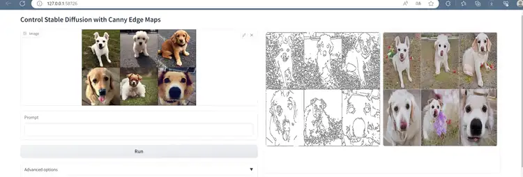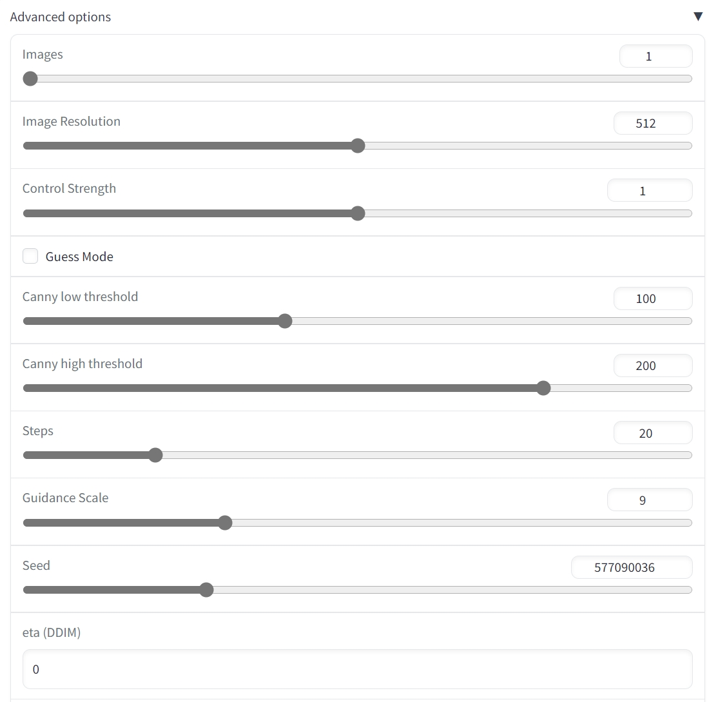

  - Images：生成几张图片。

  - Image Resolution：生成的图片分辨率。

  - Control Strength：ControlNet分成Stable Diffusion和ControlNet两部分，这个参数是ControlNet所占的权重，当下面的Guess Mode未选中ControlNet部分的权重全都是这个值。

  - Guess Mode：不选中，模型在处理Negative Prompt部分时，Stable Diffusion和ControlNet两部分全有效；选中，在处理Negative Prompt部分时，只走Stable Diffusion分支，ControlNet部分无效。

  - Canny low threshold：Canny的参数，如果边缘像素值小于低阈值，则会被抑制。

  - Canny high threshold：Canny的参数，边缘像素的值高于高阈值，将其标记为强边缘像素。


  - Steps：执行多少次“去噪”操作。


  - Guidance Scale：正向prompt所占比重，下面代码中的unconditional_guidance_scale就是这个参数,model_t是正向prompt+Added Prompt生成的特征，model_uncond是Negative Prompt生成的特征。


  - Seed：生成噪声图时的随机种子，当这个值一定，其他条件不变的情况下，生成的结果也不变。


  - eta (DDIM)：DDIM采样中的eta值。


  - Added Prompt：附加的正面prompt，比如best quality, extremely detailed。

#### 模型训练

##### 训练数据集

- 训练数据需要3种文件，原图、cannyMap图和对应的Prompt，如果只是想训练流程跑通，可以使用fill50k数据集，如果要使用自己的数据集，就要准备自己需要的风格的图片了。

- 生成map

  ```
  python gradio_annotator.py
  ```

- 生成对应的Prompt

  - 调用SD-webui，使用deepbooru插件生成prompt。

- 生成prompt.json


- SD的预训练模型

  - 需要提前将SD的预训练模型如v1-5-pruned.ckpt · runwayml/stable-diffusion-v1-5 at main (huggingface.co)下载到./models/下。

  ```
  python tool_add_control.py  ./models/v1-5-pruned.ckpt ./models/control_sd15_ini.ckpt
  ```

- 执行训练

  - 准备好上述材料map-image-prompt后，执行训练。

  ```
  python tutorial_train.py
  ```


## 问题以及补充材料

- prompt能否把pos和neg组合起来一起算？

  - A：能。  根据SD的源码ldm.models.diffusion.ddim里189-211行，unconditional（neg_context）和conditional(context)进行concat，将[1，77，768]按dim=0拼接，得到[2，77，768]，可以将neg_prompt和prompt只过一次Unet，然后将得到的pred_noise进行chunk操作，将两部分pred_noise加权求和。

  ```python
  """SAMPLING ONLY."""
   
  import torch
  import numpy as np
  from tqdm import tqdm
   
  from ldm.modules.diffusionmodules.util import make_ddim_sampling_parameters, make_ddim_timesteps, noise_like, extract_into_tensor
   
   
  class DDIMSampler(object):
      def __init__(self, model, schedule="linear", **kwargs):
          super().__init__()
          self.model = model
          self.ddpm_num_timesteps = model.num_timesteps
          self.schedule = schedule
   
      def register_buffer(self, name, attr):
          if type(attr) == torch.Tensor:
              if attr.device != torch.device("cuda"):
                  attr = attr.to(torch.device("cuda"))
          setattr(self, name, attr)
   
      def make_schedule(self, ddim_num_steps, ddim_discretize="uniform", ddim_eta=0., verbose=True):
          self.ddim_timesteps = make_ddim_timesteps(ddim_discr_method=ddim_discretize, num_ddim_timesteps=ddim_num_steps,
                                                    num_ddpm_timesteps=self.ddpm_num_timesteps,verbose=verbose)
          alphas_cumprod = self.model.alphas_cumprod
          assert alphas_cumprod.shape[0] == self.ddpm_num_timesteps, 'alphas have to be defined for each timestep'
          to_torch = lambda x: x.clone().detach().to(torch.float32).to(self.model.device)
   
          self.register_buffer('betas', to_torch(self.model.betas))
          self.register_buffer('alphas_cumprod', to_torch(alphas_cumprod))
          self.register_buffer('alphas_cumprod_prev', to_torch(self.model.alphas_cumprod_prev))
   
          # calculations for diffusion q(x_t | x_{t-1}) and others
          self.register_buffer('sqrt_alphas_cumprod', to_torch(np.sqrt(alphas_cumprod.cpu())))
          self.register_buffer('sqrt_one_minus_alphas_cumprod', to_torch(np.sqrt(1. - alphas_cumprod.cpu())))
          self.register_buffer('log_one_minus_alphas_cumprod', to_torch(np.log(1. - alphas_cumprod.cpu())))
          self.register_buffer('sqrt_recip_alphas_cumprod', to_torch(np.sqrt(1. / alphas_cumprod.cpu())))
          self.register_buffer('sqrt_recipm1_alphas_cumprod', to_torch(np.sqrt(1. / alphas_cumprod.cpu() - 1)))
   
          # ddim sampling parameters
          ddim_sigmas, ddim_alphas, ddim_alphas_prev = make_ddim_sampling_parameters(alphacums=alphas_cumprod.cpu(),
                                                                                     ddim_timesteps=self.ddim_timesteps,
                                                                                     eta=ddim_eta,verbose=verbose)
          self.register_buffer('ddim_sigmas', ddim_sigmas)
          self.register_buffer('ddim_alphas', ddim_alphas)
          self.register_buffer('ddim_alphas_prev', ddim_alphas_prev)
          self.register_buffer('ddim_sqrt_one_minus_alphas', np.sqrt(1. - ddim_alphas))
          sigmas_for_original_sampling_steps = ddim_eta * torch.sqrt(
              (1 - self.alphas_cumprod_prev) / (1 - self.alphas_cumprod) * (
                          1 - self.alphas_cumprod / self.alphas_cumprod_prev))
          self.register_buffer('ddim_sigmas_for_original_num_steps', sigmas_for_original_sampling_steps)
   
      @torch.no_grad()
      def sample(self,
                 S,
                 batch_size,
                 shape,
                 conditioning=None,
                 callback=None,
                 normals_sequence=None,
                 img_callback=None,
                 quantize_x0=False,
                 eta=0.,
                 mask=None,
                 x0=None,
                 temperature=1.,
                 noise_dropout=0.,
                 score_corrector=None,
                 corrector_kwargs=None,
                 verbose=True,
                 x_T=None,
                 log_every_t=100,
                 unconditional_guidance_scale=1.,
                 unconditional_conditioning=None, # this has to come in the same format as the conditioning, # e.g. as encoded tokens, ...
                 dynamic_threshold=None,
                 ucg_schedule=None,
                 **kwargs
                 ):
          if conditioning is not None:
              if isinstance(conditioning, dict):
                  ctmp = conditioning[list(conditioning.keys())[0]]
                  while isinstance(ctmp, list): ctmp = ctmp[0]
                  cbs = ctmp.shape[0]
                  if cbs != batch_size:
                      print(f"Warning: Got {cbs} conditionings but batch-size is {batch_size}")
   
              elif isinstance(conditioning, list):
                  for ctmp in conditioning:
                      if ctmp.shape[0] != batch_size:
                          print(f"Warning: Got {cbs} conditionings but batch-size is {batch_size}")
   
              else:
                  if conditioning.shape[0] != batch_size:
                      print(f"Warning: Got {conditioning.shape[0]} conditionings but batch-size is {batch_size}")
   
          self.make_schedule(ddim_num_steps=S, ddim_eta=eta, verbose=verbose)
          # sampling
          C, H, W = shape
          size = (batch_size, C, H, W)
          print(f'Data shape for DDIM sampling is {size}, eta {eta}')
   
          samples, intermediates = self.ddim_sampling(conditioning, size,
                                                      callback=callback,
                                                      img_callback=img_callback,
                                                      quantize_denoised=quantize_x0,
                                                      mask=mask, x0=x0,
                                                      ddim_use_original_steps=False,
                                                      noise_dropout=noise_dropout,
                                                      temperature=temperature,
                                                      score_corrector=score_corrector,
                                                      corrector_kwargs=corrector_kwargs,
                                                      x_T=x_T,
                                                      log_every_t=log_every_t,
                                                      unconditional_guidance_scale=unconditional_guidance_scale,
                                                      unconditional_conditioning=unconditional_conditioning,
                                                      dynamic_threshold=dynamic_threshold,
                                                      ucg_schedule=ucg_schedule
                                                      )
          return samples, intermediates
   
      @torch.no_grad()
      def ddim_sampling(self, cond, shape,
                        x_T=None, ddim_use_original_steps=False,
                        callback=None, timesteps=None, quantize_denoised=False,
                        mask=None, x0=None, img_callback=None, log_every_t=100,
                        temperature=1., noise_dropout=0., score_corrector=None, corrector_kwargs=None,
                        unconditional_guidance_scale=1., unconditional_conditioning=None, dynamic_threshold=None,
                        ucg_schedule=None):
          device = self.model.betas.device
          b = shape[0]
          if x_T is None:
              img = torch.randn(shape, device=device)
          else:
              img = x_T
   
          if timesteps is None:
              timesteps = self.ddpm_num_timesteps if ddim_use_original_steps else self.ddim_timesteps
          elif timesteps is not None and not ddim_use_original_steps:
              subset_end = int(min(timesteps / self.ddim_timesteps.shape[0], 1) * self.ddim_timesteps.shape[0]) - 1
              timesteps = self.ddim_timesteps[:subset_end]
   
          intermediates = {'x_inter': [img], 'pred_x0': [img]}
          time_range = reversed(range(0,timesteps)) if ddim_use_original_steps else np.flip(timesteps)
          total_steps = timesteps if ddim_use_original_steps else timesteps.shape[0]
          print(f"Running DDIM Sampling with {total_steps} timesteps")
   
          iterator = tqdm(time_range, desc='DDIM Sampler', total=total_steps)
   
          for i, step in enumerate(iterator):
              index = total_steps - i - 1
              ts = torch.full((b,), step, device=device, dtype=torch.long)
   
              if mask is not None:
                  assert x0 is not None
                  img_orig = self.model.q_sample(x0, ts)  # TODO: deterministic forward pass?
                  img = img_orig * mask + (1. - mask) * img
   
              if ucg_schedule is not None:
                  assert len(ucg_schedule) == len(time_range)
                  unconditional_guidance_scale = ucg_schedule[i]
   
              outs = self.p_sample_ddim(img, cond, ts, index=index, use_original_steps=ddim_use_original_steps,
                                        quantize_denoised=quantize_denoised, temperature=temperature,
                                        noise_dropout=noise_dropout, score_corrector=score_corrector,
                                        corrector_kwargs=corrector_kwargs,
                                        unconditional_guidance_scale=unconditional_guidance_scale,
                                        unconditional_conditioning=unconditional_conditioning,
                                        dynamic_threshold=dynamic_threshold)
              img, pred_x0 = outs
              if callback: callback(i)
              if img_callback: img_callback(pred_x0, i)
   
              if index % log_every_t == 0 or index == total_steps - 1:
                  intermediates['x_inter'].append(img)
                  intermediates['pred_x0'].append(pred_x0)
   
          return img, intermediates
   
      @torch.no_grad()
      def p_sample_ddim(self, x, c, t, index, repeat_noise=False, use_original_steps=False, quantize_denoised=False,
                        temperature=1., noise_dropout=0., score_corrector=None, corrector_kwargs=None,
                        unconditional_guidance_scale=1., unconditional_conditioning=None,
                        dynamic_threshold=None):
          b, *_, device = *x.shape, x.device
   
          if unconditional_conditioning is None or unconditional_guidance_scale == 1.:
              model_output = self.model.apply_model(x, t, c)
          else:
              x_in = torch.cat([x] * 2)
              t_in = torch.cat([t] * 2)
              if isinstance(c, dict):
                  assert isinstance(unconditional_conditioning, dict)
                  c_in = dict()
                  for k in c:
                      if isinstance(c[k], list):
                          c_in[k] = [torch.cat([
                              unconditional_conditioning[k][i],
                              c[k][i]]) for i in range(len(c[k]))]
                      else:
                          c_in[k] = torch.cat([
                                  unconditional_conditioning[k],
                                  c[k]])
              elif isinstance(c, list):
                  c_in = list()
                  assert isinstance(unconditional_conditioning, list)
                  for i in range(len(c)):
                      c_in.append(torch.cat([unconditional_conditioning[i], c[i]]))
              else:
                  c_in = torch.cat([unconditional_conditioning, c])
              model_uncond, model_t = self.model.apply_model(x_in, t_in, c_in).chunk(2)
              model_output = model_uncond + unconditional_guidance_scale * (model_t - model_uncond)
   
          if self.model.parameterization == "v":
              e_t = self.model.predict_eps_from_z_and_v(x, t, model_output)
          else:
              e_t = model_output
   
          if score_corrector is not None:
              assert self.model.parameterization == "eps", 'not implemented'
              e_t = score_corrector.modify_score(self.model, e_t, x, t, c, **corrector_kwargs)
   
          alphas = self.model.alphas_cumprod if use_original_steps else self.ddim_alphas
          alphas_prev = self.model.alphas_cumprod_prev if use_original_steps else self.ddim_alphas_prev
          sqrt_one_minus_alphas = self.model.sqrt_one_minus_alphas_cumprod if use_original_steps else self.ddim_sqrt_one_minus_alphas
          sigmas = self.model.ddim_sigmas_for_original_num_steps if use_original_steps else self.ddim_sigmas
          # select parameters corresponding to the currently considered timestep
          a_t = torch.full((b, 1, 1, 1), alphas[index], device=device)
          a_prev = torch.full((b, 1, 1, 1), alphas_prev[index], device=device)
          sigma_t = torch.full((b, 1, 1, 1), sigmas[index], device=device)
          sqrt_one_minus_at = torch.full((b, 1, 1, 1), sqrt_one_minus_alphas[index],device=device)
   
          # current prediction for x_0
          if self.model.parameterization != "v":
              pred_x0 = (x - sqrt_one_minus_at * e_t) / a_t.sqrt()
          else:
              pred_x0 = self.model.predict_start_from_z_and_v(x, t, model_output)
   
          if quantize_denoised:
              pred_x0, _, *_ = self.model.first_stage_model.quantize(pred_x0)
   
          if dynamic_threshold is not None:
              raise NotImplementedError()
   
          # direction pointing to x_t
          dir_xt = (1. - a_prev - sigma_t**2).sqrt() * e_t
          noise = sigma_t * noise_like(x.shape, device, repeat_noise) * temperature
          if noise_dropout > 0.:
              noise = torch.nn.functional.dropout(noise, p=noise_dropout)
          x_prev = a_prev.sqrt() * pred_x0 + dir_xt + noise
          return x_prev, pred_x0
   
      @torch.no_grad()
      def encode(self, x0, c, t_enc, use_original_steps=False, return_intermediates=None,
                 unconditional_guidance_scale=1.0, unconditional_conditioning=None, callback=None):
          num_reference_steps = self.ddpm_num_timesteps if use_original_steps else self.ddim_timesteps.shape[0]
   
          assert t_enc <= num_reference_steps
          num_steps = t_enc
   
          if use_original_steps:
              alphas_next = self.alphas_cumprod[:num_steps]
              alphas = self.alphas_cumprod_prev[:num_steps]
          else:
              alphas_next = self.ddim_alphas[:num_steps]
              alphas = torch.tensor(self.ddim_alphas_prev[:num_steps])
   
          x_next = x0
          intermediates = []
          inter_steps = []
          for i in tqdm(range(num_steps), desc='Encoding Image'):
              t = torch.full((x0.shape[0],), i, device=self.model.device, dtype=torch.long)
              if unconditional_guidance_scale == 1.:
                  noise_pred = self.model.apply_model(x_next, t, c)
              else:
                  assert unconditional_conditioning is not None
                  e_t_uncond, noise_pred = torch.chunk(
                      self.model.apply_model(torch.cat((x_next, x_next)), torch.cat((t, t)),
                                             torch.cat((unconditional_conditioning, c))), 2)
                  noise_pred = e_t_uncond + unconditional_guidance_scale * (noise_pred - e_t_uncond)
   
              xt_weighted = (alphas_next[i] / alphas[i]).sqrt() * x_next
              weighted_noise_pred = alphas_next[i].sqrt() * (
                      (1 / alphas_next[i] - 1).sqrt() - (1 / alphas[i] - 1).sqrt()) * noise_pred
              x_next = xt_weighted + weighted_noise_pred
              if return_intermediates and i % (
                      num_steps // return_intermediates) == 0 and i < num_steps - 1:
                  intermediates.append(x_next)
                  inter_steps.append(i)
              elif return_intermediates and i >= num_steps - 2:
                  intermediates.append(x_next)
                  inter_steps.append(i)
              if callback: callback(i)
   
          out = {'x_encoded': x_next, 'intermediate_steps': inter_steps}
          if return_intermediates:
              out.update({'intermediates': intermediates})
          return x_next, out
   
      @torch.no_grad()
      def stochastic_encode(self, x0, t, use_original_steps=False, noise=None):
          # fast, but does not allow for exact reconstruction
          # t serves as an index to gather the correct alphas
          if use_original_steps:
              sqrt_alphas_cumprod = self.sqrt_alphas_cumprod
              sqrt_one_minus_alphas_cumprod = self.sqrt_one_minus_alphas_cumprod
          else:
              sqrt_alphas_cumprod = torch.sqrt(self.ddim_alphas)
              sqrt_one_minus_alphas_cumprod = self.ddim_sqrt_one_minus_alphas
   
          if noise is None:
              noise = torch.randn_like(x0)
          return (extract_into_tensor(sqrt_alphas_cumprod, t, x0.shape) * x0 +
                  extract_into_tensor(sqrt_one_minus_alphas_cumprod, t, x0.shape) * noise)
   
      @torch.no_grad()
      def decode(self, x_latent, cond, t_start, unconditional_guidance_scale=1.0, unconditional_conditioning=None,
                 use_original_steps=False, callback=None):
   
          timesteps = np.arange(self.ddpm_num_timesteps) if use_original_steps else self.ddim_timesteps
          timesteps = timesteps[:t_start]
   
          time_range = np.flip(timesteps)
          total_steps = timesteps.shape[0]
          print(f"Running DDIM Sampling with {total_steps} timesteps")
   
          iterator = tqdm(time_range, desc='Decoding image', total=total_steps)
          x_dec = x_latent
          for i, step in enumerate(iterator):
              index = total_steps - i - 1
              ts = torch.full((x_latent.shape[0],), step, device=x_latent.device, dtype=torch.long)
              x_dec, _ = self.p_sample_ddim(x_dec, cond, ts, index=index, use_original_steps=use_original_steps,
                                            unconditional_guidance_scale=unconditional_guidance_scale,
                                            unconditional_conditioning=unconditional_conditioning)
              if callback: callback(i)
          return x_dec
  ```

  

  - 其中clipmodel.get_learned_conditioning的dataflow为：
    - add_prompt+prompt[text]->CLIPTokenizer[1，77]→CLIPTextModel[1，77，768]
    - neg_prompt[text]→]CLIPTokenizer[1，77]→CLIPTextModel[1，77，768]

- 推理时batch为2的原因？如（2，3，512，512）
  - A：该问题同Q1。code参考A1的相同位置，context.shape变为[2，77，768]后，noise.shape经过concat为[2，4，64，64]，t.shape也变repeat为[2]，目的是为了避免context依次走两遍Unet，但是在出Unet后就chunk(2，dim=0)切位一份了。

- 能否将ControlNet和SD的prompt交互作batch？
  - A：不能。经过neg和prompt在context后拼接起来为[2，77，768]，先跑controlnet，后再跑SD。两个model需要的context是一个东西，得依次跑两次。

- guess mode的原理是什么？

  - A：guess mode是个bool型超参，True时，Controlnet只输出neg_prompt的context，不处理map_input部分，即map_input无效；False时，Crontrolnet正常输出context和map。code如下。

  - ```python
    cond = {"c_concat": [control], "c_crossattn": [model.get_learned_conditioning([prompt + ', ' + a_prompt] * num_samples)]}
    un_cond = {"c_concat": None if guess_mode else [control], "c_crossattn": [model.get_learned_conditioning([n_prompt] * num_samples)]}
     
    def apply_model(self, x_noisy, t, cond, *args, **kwargs):
            assert isinstance(cond, dict)
            diffusion_model = self.model.diffusion_model
     
            cond_txt = torch.cat(cond['c_crossattn'], 1)
     
            if cond['c_concat'] is None:
                eps = diffusion_model(x=x_noisy, timesteps=t, context=cond_txt, control=None, only_mid_control=self.only_mid_control)
            else:
                control = self.control_model(x=x_noisy, hint=torch.cat(cond['c_concat'], 1), timesteps=t, context=cond_txt)
                control = [c * scale for c, scale in zip(control, self.control_scales)]
                eps = diffusion_model(x=x_noisy, timesteps=t, context=cond_txt, control=control, only_mid_control=self.only_mid_control)
    ```

- 可以支持两个controlnet一起用是什么原理？

  - A：lllyasviel/ControlNet-v1-1-nightly: Nightly release of ControlNet 1.1 (github.com)最新的V1.1版本找到了多个模型一起用的源码了，待tile模型调研完毕后解释这个问题。

- Dataflow可以简化下并按照模块信息依赖来表明执行顺序（先以模块为单位）

  - A：第三章Dataflow已重新绘制。

- 支持neg prompt来引导生成的原理是什么？

  - A：该问题同Q1，理论同classifier-free guidance，neg-prompt->context流程同prompt，其中classsifier-free-guidance同训练流程一起补充在SD文档里。

- Controlnet的推理(4~15)是可以和StableDiffusion的Encoder推理(17~25)并行推理的吗？

  - A：能，两条pipe之间在SD运行到Decoder之前都无数据依赖关系，可以选择controlnet和SD的encoder部分同时跑。

- 训练Controlnet时是否也能训练Decoder？

  - A：能。依照paper和源码，训练时可以调节两个超参，sd_locked 和only_mid_control。源码里如下15-16行。

  - ```python
    from share import *
     
    import pytorch_lightning as pl
    from torch.utils.data import DataLoader
    from tutorial_dataset import MyDataset
    from cldm.logger import ImageLogger
    from cldm.model import create_model, load_state_dict
     
     
    # Configs
    resume_path = './models/control_sd15_ini.ckpt'
    batch_size = 4
    logger_freq = 300
    learning_rate = 1e-5
    sd_locked = True
    only_mid_control = False
     
     
    # First use cpu to load models. Pytorch Lightning will automatically move it to GPUs.
    model = create_model('./models/cldm_v15.yaml').cpu()
    model.load_state_dict(load_state_dict(resume_path, location='cpu'))
    model.learning_rate = learning_rate
    model.sd_locked = sd_locked
    model.only_mid_control = only_mid_control
     
     
    # Misc
    dataset = MyDataset()
    dataloader = DataLoader(dataset, num_workers=0, batch_size=batch_size, shuffle=True)
    logger = ImageLogger(batch_frequency=logger_freq)
    trainer = pl.Trainer(gpus=1, precision=32, callbacks=[logger])
     
     
    # Train!
    trainer.fit(model, dataloader)
    ```

- 
  可以根据训练设备选择三种不同的训练方式：

  - 小算力设备：sd_locked = True，only_mid_control = True，即SD整个参数冻结，Controlnet仅训练mid_control，断开其encoder的连接。如图所示。

  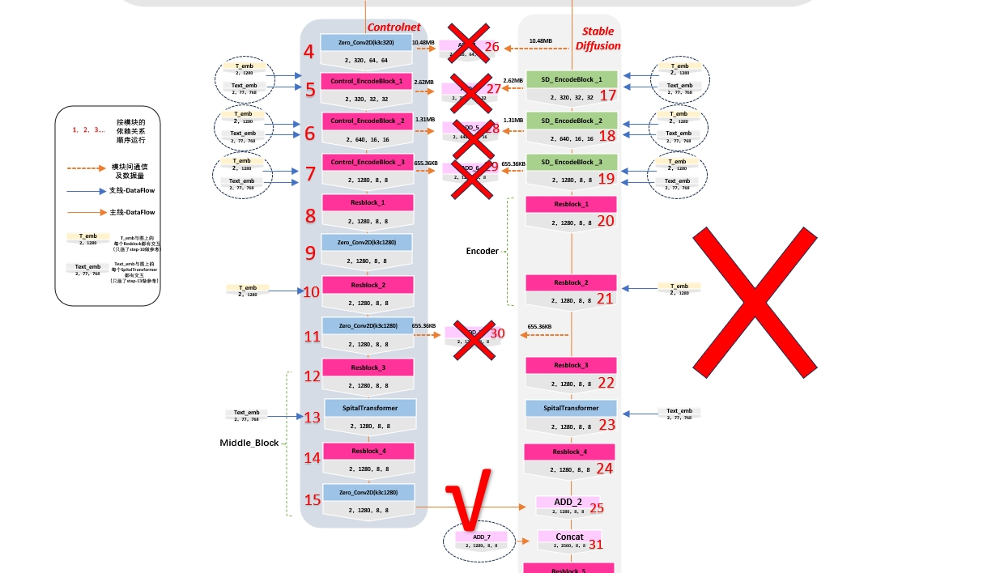

  - 中算力设备：sd_locked = True， only_mid_control = False，默认设置，即SD整个参数冻结，Controlnet全部训练。如图所示。

  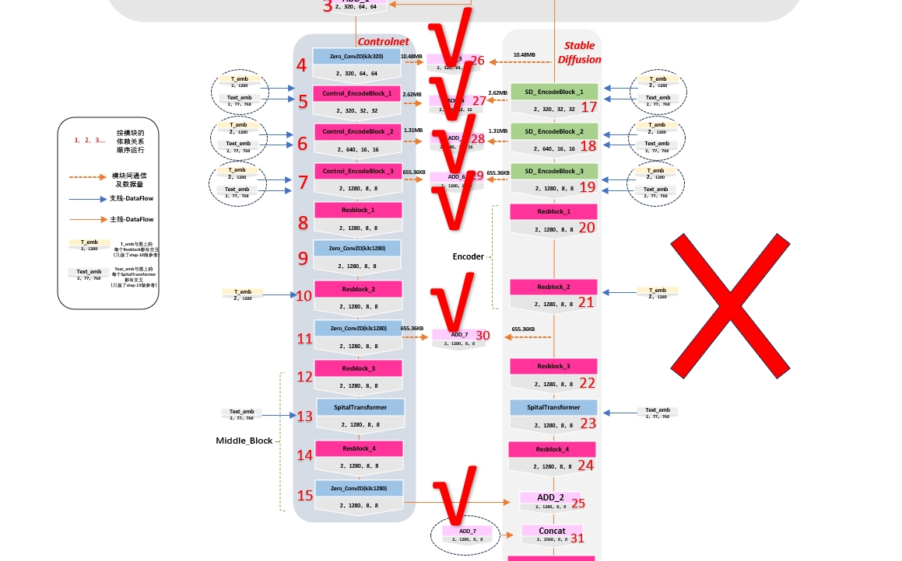

  - 大算力设备：sd_locked = False， only_mid_control = False，即SD和Controlnet同时训练，相当于练了一个半SD，但理论上可以对特定任务达到最优适配性。


