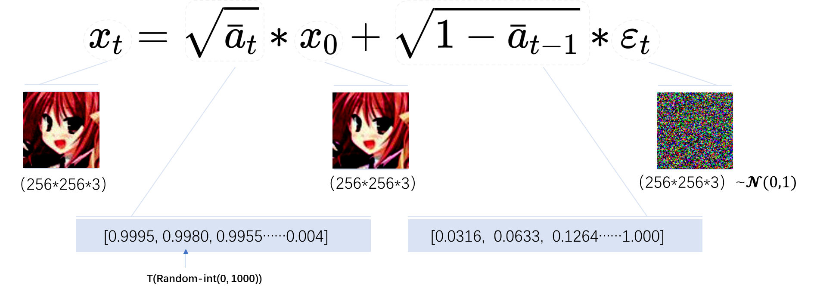

# 1.Stable Diffusion

## 基本概念

### 扩散模型-DDPM

- 扩散模型Diffusion Model是一类生成模型的数学原理，分为两个阶段：前向阶段和反向阶段。扩散模型的前向阶段也成为加噪阶段，定义为马尔科夫链，即扩散模型的前向阶段在后一步的数据分布由前一时刻决定，该scheduler称为DDPM[[2006.11239\] Denoising Diffusion Probabilistic Models (arxiv.org)](https://arxiv.org/abs/2006.11239)。
- 以下以动漫头像为示意图例，以便更好理解加噪过程。

- 公式描述如下

  马尔可夫链定义如下，其中ϵ∈N(μ,σ)，服从高斯分布，即加噪T次后的图像服从高斯分布。

$$
x_0 \stackrel{q}{\rightarrow} x_1 \stackrel{q}{\rightarrow} x_2 \cdots \stackrel{q}{\rightarrow} x_T=\epsilon
$$

​	加噪的公式定义如下，其中at−−√∈(0,1），t∈(0,1000)，即t时刻的加噪强度。
$$
x_t=\sqrt{\overline{a_t}} * x_{t-1}+\sqrt{1-a_t} * \epsilon_{t-1}
$$
​	同理，ϵt−1∼N(0,1)，即t−1时刻的图像由t−2时刻的图像加噪得来，加噪可以理解为原图覆盖一层噪声图。
$$
x_{t-1}=\sqrt{a_{t-1}} * x_{t-2}+\sqrt{1-a_{t-1}} * \epsilon_{t-2}
$$
​	代入得到，即t时刻的加噪图像可以由t−2时刻的图像推导得到。
$$
x_t=\sqrt{a_t} *\left(\sqrt{a_{t-1}} * x_{t-2}+\sqrt{1-a_{t-1}} * \epsilon_{t-2}\right)+\sqrt{1-a_t} * \epsilon_{t-1}
$$
​	化简得，可以看到ϵt−1和ϵt−2同为高斯分布的采样，只是t时刻不同。
$$
\left.\left.x_t=\sqrt{a_t} * \sqrt{a_{t-1}} * x_{t-2}+\left(\sqrt{a_t *\left(1-a_{t-1}\right.}\right) * \epsilon_{t-2}\right)+\sqrt{1-a_t} * \epsilon_{t-1}\right) \\
$$
​	其中，
$$
\left.\left(\sqrt{a_t *\left(1-a_{t-1}\right.}\right) * \epsilon_{t-2}\right) \sim N\left(0, a_t *\left(1-a_{t-1}\right)\right) \\
\left(\sqrt{\left(1-a_t\right)} * \epsilon_{t-1}\right) \sim N\left(0,\left(1-a_t\right)\right)
$$
​	由独立高斯分布可加性化简得，即可以将两个高斯分布的和重写如下，
$$
\left(\sqrt{a_t *\left(1-a_{t-1}\right)} * \epsilon_{t-2}+\left(\sqrt{\left(1-a_t\right)} * \epsilon_{t-1}\right) \sim N\left(0,\left(1-a_t * a_{t-1}\right)\right)\right.
$$
​	最终得到，可以看出t时刻的加噪图像与t−1和t−2的加噪强度与噪声采样有关。
$$
x_t=\sqrt{a_t * a_{t-1}} * x_{t-2}+\sqrt{1-a_t * a_{t-1}} * \epsilon_{t-2}
$$
​	递推公式得，可以推导所有t时刻的情况。
$$
x_t=\sqrt{a_t * a_{t-1} * a_{t-2} \cdots * a_1} * x_0+\sqrt{1-a_t * a_{t-1} * a_{t-2} \cdots * a_1} * \epsilon_t
$$
​	因此可以得到前向阶段的任意分布，其中 记为t时刻的所有加噪强度累乘，x0为未加噪的初始图像，ϵt	为t时刻的噪声采样。
$$
q\left(x_t \mid x_0\right)=\sqrt{\overline{a_t}} * x_0+\sqrt{1-\overline{\overline{a_t}}} * \epsilon_{\mathrm{t}} \sim N\left(x_t ; \sqrt{a_t} * x_0, 1-\overline{a_t}\right)
$$
​	加噪过程是确定的,没有模型的介入. 其目的是制作训练时标签。以上介绍完了DDPM的前向阶段，完成了加噪	过程。该部分的code如下。

```python
def linear_beta_schedule(timesteps):
    scale = 1000 / timesteps
    beta_start = scale * 0.0001
    beta_end = scale * 0.02
    return torch.linspace(beta_start, beta_end, timesteps, dtype = torch.float64)
​
​
def extract(a, t, x_shape):
    b, *_ = t.shape
    out = a.gather(-1, t)
    return out.reshape(b, *((1,) * (len(x_shape) - 1)))
​
   
def q_sample(x_start, t, noise=None):
  """
  \begin{eqnarray}
    x_t &=& \sqrt{\alpha_t}x_{t-1} + \sqrt{(1 - \alpha_t)}z_t \nonumber \\
    &=&  \sqrt{\alpha_t}x_{t-1} + \sqrt{\beta_t}z_t
  \end{eqnarray}
  """
    return (
        extract(sqrt_alphas_cumprod, t, x_start.shape) * x_start +
        extract(sqrt_one_minus_alphas_cumprod, t, x_start.shape) * noise
    )
 
t = torch.randint(0, self.num_timesteps, (b,), device=device).long()  # 随机采样时间步
noise = default(noise, lambda: torch.randn_like(x_start))  # 基于高斯分布采样噪声
betas = linear_beta_schedule(timesteps)
alphas = 1. - betas
alphas_cumprod = torch.cumprod(alphas, dim=0)
sqrt_one_minus_alphas_cumprod = torch.sqrt(1. - alphas_cumprod)
sqrt_alphas_cumprod = torch.sqrt(alphas_cumprod)
x = q_sample(x_start = x_start, t = t, noise = noise)  # 这就是x0在时间步T的输出
```

- **反向阶段**

  - 扩散模型的反向阶段也成为去噪阶段，目的是将前向阶段加的噪声一步步去掉，然后得到干净的无噪图。
  - 以下图例展示以便更好的理解反向阶段的过程。

  公式如下，

$$
\epsilon=x_T \stackrel{P}{\rightarrow} x_{T-1} \stackrel{p}{\rightarrow} \ldots x_1 \stackrel{P}{\rightarrow} x_0
$$

​	求解目标如下，p(xt|xt−1,x0）代表已知xt−1,x0的情况下求xt的分布，根据贝叶斯公式可以列出下式。
$$
p\left(x_{t-1} \mid x_t, x_0\right)=\frac{p\left(x_t \mid x_{t-1}, x_0\right) * p\left(x_{t-1} \mid x_0\right)}{p\left(x_t \mid x_0\right)}=\frac{N\left(x_t ; \sqrt{a_t} * x_{t-1},\left(1-a_t\right)\right) * N\left(x_{t-1} ; \sqrt{a_{t-1}} * x_0,\left(1-\bar{a}_{t-1}\right)\right)}{N\left(x_t ; \sqrt{a_t} * x_t,\left(1-\bar{a}_t\right)\right)}
$$
​	标准高斯分布展开得，
$$
\exp \left(-\frac{(x-\mu)^2}{2 * \sigma^2}\right)=\exp \left(-0.5 *\left(\frac{1}{\sigma^2} * x^2+\frac{2 * \mu}{\sigma^2} * x+\frac{\mu^2}{\sigma^2}\right)\right)
$$
因此将上式以高斯分布形式计算并化简得，
$$
p\left(x_{t-1} \mid x_t, x_0\right)=\exp \left(-0.5 *\left(\left(\frac{a_t}{1-a_t}+\frac{1}{1-\bar{a}_{t-1}}\right) * x_{t-1}^2-\left(\frac{2 \sqrt{\bar{a}_t}}{1-a_t} * x_t+\frac{2 * \sqrt{\bar{a}_{t-1}}}{1-\bar{a}_{t-1}} * x_0\right) * x_{t-1}+C *\left(x_t, x_0\right)\right.\right.
$$
对比标准高斯分布，可以求得对应的均值μ和方差σ2如下，
$$
\begin{gathered}
\sigma^2=\frac{1-\bar{a}_{t-1}}{1-\bar{a}_t} *\left(1-a_t\right) \\
\mu=\frac{\sqrt{a_t} *\left(1-\bar{a}_{t-1}\right)}{1-\bar{a}_t} * x_t+\frac{\sqrt{\bar{a}_{t-1}} *\left(1-a_t\right)}{1-\bar{a}_t} * x_0
\end{gathered}
$$
求得目标的分布是高斯分布且获得了均值μ和方差σ2，最终分布表示如下，

$$
p\left(x_{t-1} \mid x_t, x_0\right)=\mathcal{N}\left(x_{t-1} ; \frac{\sqrt{a_t} *\left(1-\bar{a}_{t-1}\right)}{1-\bar{a}_t} * x_t+\frac{\sqrt{\bar{\alpha}_{t-1}} *\left(1-a_t\right)}{1-\bar{a}_t} * x_0,\left(\frac{1-\bar{a}_{t-1}}{1-\bar{a}_t} *\left(1-a_t\right)\right)\right)
$$
由于目标分布的方差为常数，均值的构成较为复杂，且有未知数，需要网络去拟合该分布，网络拟合的目标最小化两个高斯分布的均值μ和μθ(xt,t)，如下，
$$
\arg \min _\theta\left\|\mu, \mu_\theta\left(x_t, t\right)\right\|
$$
将网络拟合的均值μθ(xt,t)构成定义如下，
$$
\mu_0\left(x_t, t\right)=\frac{\sqrt{a_t}\left(1-\bar{a}_{t-1}\right)}{1-\bar{a}_t} x_t+\frac{\sqrt{\bar{a}_{t-1}}\left(1-a_t\right)}{1-\bar{a}_t} f_0\left(x_t, t\right)
$$
即模型的输入是当前时刻的带噪图像和time_step，输出的是未加噪的原始图片。但DDPM在这里做了优化，不直接预测未加噪的原始图片，而是预测time_step时的噪声，因此第一步先将目标均值的构成变形如下，

$$
\begin{gathered}
x_0=\frac{1}{\sqrt{a_t}} *\left(x_t-\sqrt{1-\bar{a}_t} * \epsilon_t\right) \\
\mu=\frac{1}{\sqrt{a}_t} * x_t-\frac{1-a_t}{\sqrt{a_t} * \sqrt{1-\bar{a}_t}} * \epsilon_t
\end{gathered}
$$
因此网络拟合的均值以此变形为，
$$
\mu_\theta\left(x_t, t\right)=\frac{1}{\sqrt{a_t}} * x_t-\frac{1-a_t}{\sqrt{a_t} * \sqrt{1-\bar{a}_t}} * \epsilon_\theta\left(x_t, t\right)
$$
即模型的输入是当前step的带噪图像和time_step，输出的是预测的noise map（对应前向阶段加的noise map），因此可以理解为网络拟合的是噪声图的采样，损失函数可以采用MSE或者L1等距离损失，到此可以开始导入数据来训练网络了。

$$
\mathbb{E}_{t \sim T}\left\|\epsilon_t-\epsilon_\theta\left(x_t, t\right)\right\|_2^2
$$
训练结束后，在推理时用网络预测出noise map，依据均值和noise map的关系可以计算出均值，联合常数项方差，一步步重采样出去噪后的图像，采样流程如下，
$$
x_{t-1}=\mu_\theta\left(x_t, t\right)+\sigma(t) * z=\frac{1}{\sqrt{a_{\ell}}} * x_t-\frac{1-a_t}{\sqrt{a_t} * \sqrt{1-\bar{a}_t}} * \epsilon_\theta\left(x_t, t\right)+\sigma(t) * z, z \in N(0,1)
$$
采样的核心公式如上，采样的过程就是unet+scheduler，采样的理解就是去噪加生成图像。该部分code如下

```python
def extract(a, t, x_shape):
    b, *_ = t.shape
    out = a.gather(-1, t)
    return out.reshape(b, *((1,) * (len(x_shape) - 1)))
   
  def q_posterior(self, x_start, x_t, t):
    posterior_mean = (
        extract(self.posterior_mean_coef1, t, x_t.shape) * x_start +
        extract(self.posterior_mean_coef2, t, x_t.shape) * x_t
    )  # 求出此时的均值
    posterior_variance = extract(self.posterior_variance, t, x_t.shape)  # 求出此时的方差
    posterior_log_variance_clipped = extract(self.posterior_log_variance_clipped, t, x_t.shape) # 对方差取对数,可能为了数值稳定性
    return posterior_mean, posterior_variance, posterior_log_variance_clipped 
   
  def p_mean_variance(self, x, t, x_self_cond = None, clip_denoised = True):
      preds = self.model_predictions(x, t, x_self_cond)  # 预测噪声
      x_start = preds.pred_x_start  # 模型预测的是在x_t时间步噪声,x_start是根据公式(12)求
​
      if clip_denoised:
          x_start.clamp_(-1., 1.)
​
      model_mean, posterior_variance, posterior_log_variance = self.q_posterior(x_start = x_start, x_t = x, t = t)
      return model_mean, posterior_variance, posterior_log_variance, x_start
 
@torch.no_grad()
  def p_sample(self, x, t: int, x_self_cond = None, clip_denoised = True):
      b, *_, device = *x.shape, x.device
      batched_times = torch.full((x.shape[0],), t, device = x.device, dtype = torch.long)
      model_mean, _, model_log_variance, x_start = self.p_mean_variance(x = x, t = batched_times, x_self_cond = x_self_cond, clip_denoised = clip_denoised)  # 计算当前分布的均值和方差
      noise = torch.randn_like(x) if t > 0 else 0. # 从高斯分布采样噪声
      pred_img = model_mean + (0.5 * model_log_variance).exp() * noise  # 根据
      return pred_img, x_start
 
img = torch.randn(shape, device=device)
posterior_mean_coef1 = betas * torch.sqrt(alphas_cumprod_prev) / (1. - alphas_cumprod) # 式(24)x_0的系数
posterior_mean_coef = (1. - alphas_cumprod_prev) * torch.sqrt(alphas) / (1. - alphas_cumprod)  # 式(24) x_t的系数
```


- **小结**

  - paper里的训练和推理流程如下，

  - 扩散模型推理时，随机生成高斯分布的噪声和time_step（默认是1000），用网络（默认是unet）接收噪声和time_step，去预测noise map，并使用scheduler来利用noise map完成该阶段的去噪，之后依次迭代T次（DDPM去噪同加噪都是1000次）。

  - DDPM是一类scheduler，而不同scheduler的本质区别是如何利用网络预测的noise map去得到高斯分布的均值，然后更快速的从该高斯分布中重采样。


### 扩散模型-DDIM

- 扩散模型-DDPM的改进版，目的是解决反向阶段中去噪采样过程迭代1000次的耗时问题，最终经过数学理论分析，只需20-50次迭代就可以达到DDPM的图像效果。
- 前向阶段同DDPM的分析，因此前向阶段加噪等过程没有区别。反向阶段中，DDIM不依赖马尔科夫假设，构造一个新的分布，该scheduler称为DDIM[[2010.02502\] Denoising Diffusion Implicit Models (arxiv.org)](https://arxiv.org/abs/2010.02502)。
- 公式如下，

​	承接前文，DDPM的反向阶段求解分布为，

$$
p\left(x_{t-1} \mid x_t, x_0\right)=\mathcal{N}\left(x_{t-1} ; \frac{\sqrt{a_t} *\left(1-\bar{a}_{t-1}\right)}{1-\bar{a}_t} * x_t+\frac{\sqrt{\bar{\alpha}_{t-1}} *\left(1-a_t\right)}{1-\bar{a}_t} * x_0,\left(\frac{1-\bar{a}_{t-1}}{1-\bar{a}_t} *\left(1-a_t\right)\right)\right)
$$
​	DDIM重新构造的反向阶段求解分布为，

$$
p\left(x_{t-1} \mid x_t, x_0\right)=\mathcal{N}\left(x_{t-1} ; k x_t+\lambda x_0, \sigma_t^2\right)
$$
​	将该高斯分布写成可重采样的形式如下，

$$
x_{t-1}=\lambda x_0+k x_t+\sigma \epsilon_{t-1}^{\prime}
$$
​	DDIM解决的是反向阶段的推理采样次数问题，希望前向阶段仍然满足DDPM的前向阶段的推理分布，如下，

$$
q\left(x_t \mid x_0\right)=\sqrt{\overline{a_t}} * x_0+\sqrt{1-\overline{\overline{a_t}}} * \epsilon_t \sim N\left(x_t ; \sqrt{\overline{a_t}} * x_0, 1-\overline{a_t}\right)
$$
​	将该高斯分布写成可重采样的形式如下，

$$
x_t=\sqrt{\bar{a}_t} * x_0+\sqrt{\left(1-\bar{a}_t\right)} * \epsilon_t^{\prime}
$$
​	带入上式子可得，

$$
x_{t-1}=\left(\lambda+k * \sqrt{\bar{a}_t}\right) * x_0+k * \sqrt{\left(1-\bar{a}_t\right)} * \epsilon_t^{\prime}+\sigma_t * \epsilon_{t-1}^{\prime}
$$
​	同理，以DDPM的前向阶段推理分布，

$$
x_{t-1}=\sqrt{\bar{a}_{t-1}} * x_0+\sqrt{\left(1-\bar{a}_{t-1}\right)} * \epsilon_{t-1}
$$
​	因此待定系数法可以得到，

$$
\left\{\begin{array}{l}
l \lambda+k * \sqrt{a_t}=\sqrt{\bar{a}_{t-1}} \\
k^2 *\left(1-\bar{a}_t\right)+\sigma_t^2=1-\bar{a}_{t-1}
\end{array} \Rightarrow\left(\begin{array}{l}
\lambda^* \\
k^* \\
\sigma_t^*
\end{array}\right)=\left(\begin{array}{c}
\sqrt{\sqrt{\bar{a}_{t-1}}-\sqrt{\bar{a}_t} * \sqrt{\frac{1-\bar{a}_{t-1}-\sigma_t^2}{1-\bar{a}_t}}} \\
\sqrt{\frac{1-\bar{a}_{t-1}-\sigma_t^2}{1-\bar{a}_t}} \\
\sigma_t
\end{array}\right)\right.
$$
​	最终得到DDIM的采样分布，并写成高斯分布的可重采样形式，

$$
\begin{gathered}
p\left(x_{t-1} \mid x_t, x_0\right)=\mathcal{N}\left(x_{t-1} ; \sqrt{\bar{a}_{t-1}} * x_0+\sqrt{1-\bar{a}_{t-1}-\sigma_t^2} * \frac{x_t-\sqrt{a_t} * x_0}{\sqrt{1-\bar{a}_t}}, \sigma_t^2\right) \\
x_{t-1}=\sqrt{\bar{a}_{t-1}} * \frac{x_t-\sqrt{1-\bar{a}_t} * \epsilon_\theta\left(x_t, t\right)}{\sqrt{\bar{\alpha}_t}}+\sqrt{1-\bar{a}_{t-1}-\sigma_t^2} * \epsilon_\theta\left(x_t, t\right)
\end{gathered}
$$
​	但是如何缩短采样次数也能达到DDPM的1000次采样效果，公式改下如下，
$$
x_{\tau_{t-1}}=\sqrt{a_{\tau_{t-1}}} * \frac{x_{\tau_s}-\sqrt{1-\bar{a}_{\tau_s}} * \epsilon_\theta\left(x_{\tau_s}, t_{\tau_t}\right)}{\sqrt{\bar{a}_{\tau_s}}}+\sqrt{1-\bar{a}_{\tau_{t-1}}} * \epsilon_\theta\left(x_{\tau_t}, t_{\tau_s}\right)
$$
至此，DDIM的加速原理介绍完毕。paper里给出了CIFAR10数据集下 DDIM采样50次就达到了DDPM采样1000次的90%的效果。


- 小结
  - DDPM和DDIM是不同的采样scheduler，区别主要在于如何处理noise map和均值的关系。
  - 经过网络预测后得到noise map，然后依据不同的scheduler算出相应的均值和方差，然后从符合该参数的高斯分布中采样得到去噪后的图像。（DDPM需要迭代采样1000次，DDIM约50次即可）。
  - 还有一些DPMS等scheduler，迭代采样的次数约在20-50次，生成图像质量各有侧重，DDIM可以作为其中的典型代表。

### Stable diffusion

- github地址：[https://github.com/Stability-AI/generative-model](https://github.com/Stability-AI/generative-models)
- paper地址：[arxiv.org/pdf/2307.01952.pdf](https://arxiv.org/pdf/2307.01952.pdf)
- [model weigths：](https://arxiv.org/pdf/2307.01952.pdf)https://huggingface.co/stabilityai/stable-diffusion-2-1/tree/main
- 基本概念
  - diffusion model的特例，stable diffusion的核心在于之前的diffusion训练时的图像数据都以pixel domain进行（如3*512*512），在网络接收该分辨率的图像并预测noise map时，需要消耗巨大的显存资源。因此将图像数据先通过VAE编码成latent domain（如4*64*64）的向量，再通过网络推理后解码回pixel domain，能大幅减少迭代采样阶段的显存消耗，因此diffusion model得以迅速商用。
  - 由于diffusion model仅能实现nothing2image，无法完成特定内容的图像生成text2image，因此需要考虑如Classifier free guidence（第六章训练会详细解释）的trick来完成text2image以达到图像的文本可控生成。
- 小结
  - **SD是一个包含了若干model的组合模型**，各model分别处理文本、编码等功能。
  - **SD模型是生成式模型**，输入可以是图片，文本以及两者的结合，输出是生成的图片。
  - **SD模型属于扩散模型**，扩散模型的整体逻辑的特点是过程分步化与可迭代，这给整个生成过程引入更多约束与优化提供了可能。
  - **SD模型是基于Latent的扩散模型**，将输入数据压缩到Latent隐空间中，比起常规扩散模型，大幅提高计算效率的同时，降低了显存占用，成为了SD模型破圈的关键一招。

- ### 参考文献

- [Stable Diffusion 原理介绍与源码分析（一） - 知乎 (zhihu.com)](https://zhuanlan.zhihu.com/p/613337342)
- **[Diffusion 和Stable Diffusion的数学和工作原理详细解释 - 知乎 (zhihu.com)](https://zhuanlan.zhihu.com/p/597924053)**
- [Stable Diffusion模型的结构/参数量/计算量分析 - AI-algo - Confluence Canaan (b-bug.org)](https://cf.b-bug.org/pages/viewpage.action?pageId=99614908#heading-8参考文献)
- **[stable diffusion模型分析 - 知乎 (zhihu.com)](https://zhuanlan.zhihu.com/p/593161199)**
- [What is Image-to-Image? - Hugging Face](https://huggingface.co/tasks/image-to-image)
- **[How does Stable Diffusion work? - Stable Diffusion Art (stable-diffusion-art.com)](https://stable-diffusion-art.com/how-stable-diffusion-work/)**
- 公式详尽参考，[Diffusion Models (arxiv.org)](https://arxiv.org/pdf/2208.11970.pdf)
- 公式理解参考，[扩散模型之DDPM - 知乎 (zhihu.com)](https://zhuanlan.zhihu.com/p/563661713)

# 2. SD的推理Pipe和Dataflow

 该章节主要介绍SD2.1的推理Pipe和Dataflow。

## 推理Pipe


- prompt经过tokenizer处理为（1，77），随后经过text-encoder（CLIP：openai-vit-H-patch）处理为（1，77，1024），该向量称为context（或text_embedding）。
- time_step经过位置编码和Linear层得到（1，1280）的time_embedding。
- latent初始化为（1，4，64，64），然后在batch上concat为（2，4，64，64），并将context，latent，time_embedding送进Unet得到（2，4，64，64）的pred_noise，执行CFG和DDIM_scheduler。迭代T（实验值为20-50）次Unet。
- 将迭代完后的（1，4，64，64）通过VAE-decoder进行latent space→vision space的转换，输出的向量即为目标图像（1，3，512，512）。


## Dataflow 

- Unet2D
  - Unet2D的模块为CrossAttnDownBlock2D、Mid2DCrossAttn和CrossAttnUpBlock2D。
  - Unet2D的Block Dataflow及Module Dataflow如下。
  - ResnetBlock2D，Transformer2D等OP Dataflow如下。

- VAE
  - 文生图中使用的VAE为decoder，将latent→ vision，图生图中会使用到VAE的encoder。
  - VAE的module Dataflow及OP Dataflow如下。


- 计算量和参数量统计

|                        |                  |                       Stable Diffusion                       |        |                                          |
| :--------------------: | :--------------: | :----------------------------------------------------------: | :----: | ---------------------------------------- |
|         Mosule         |    Input_size    |                         output_size                          | Params | FLOPs(G)                                 |
|      Text encoder      |    （1，77）     |                        (1，77，1024）                        | 340.1  | 45.7 G * 2<br/>（pos_prompt+neg_prompt） |
|          UNet          | （2，4，64，64） |                       （2，4，64，64）                       | 859.5  | 1777.74G(单次)                           |
|      VAE decoder       | （1，4，64，64） |                      （1，3，512，512）                      |  49.5  | 2543.9 G                                 |
| Stable_Diffusion_total |        /         |                              /                               | 1066.3 | 13.6 * 2 + N*1777.74 + 2543.9            |
|     Pipeline_total     |                  | Params ≈ 1B<br/><br/>FLOPs = 45.7 * 2 + N * 1777.74 + 2543.9  ≈ 4413 G<br/><br/>（采用DDIM_step=20）<br/><br/>FLOPs = 45.7 * 2 + 20 * 1777.74 + 2543.9 = 38190 G ≈38T |        |                                          |

# 3. SD在Pytorch框架下的显存分析

 该章节分析pytorch的显存释放机制，作为显存分析的信息补充。

-  Pytorch申请显存机制

```python
def get_cuda_memory(device):
    assert isinstance(device, str), 'device should be str, please check it'
    """
    Get the current gpu memory usage.
     
    description:
        this function is used to get the current gpu memory usage
     
    usage:
        get_cuda_memory(device)
    """
    print('-----------------------------------')
    print('max_memory_allocated : {} MiB, {} KiB'.format(torch.cuda.max_memory_allocated(device) / 2**20, torch.cuda.max_memory_allocated(device) / 2**10))
    print('memory_allocated : {} MiB, {} KiB' .format(torch.cuda.memory_allocated(device) / 2**20, torch.cuda.memory_allocated(device) / 2**10))
    print('memory_reserved : {} MiB'.format(torch.cuda.memory_reserved(device) / 2**20))
    print('nvidia-smi : {} add {} = {} MiB'.format(torch.cuda.memory_reserved(device) / 2**20, 620., torch.cuda.memory_reserved(device) / 2**20 + 620.))
```

- Pytorch的机制是使用cached_allocator来管理缓存分配的，该机制下，一个Tensor就算被释放了，进程也不会把空闲出来的显存还给GPU，而是等待下一个Tensor来填入这一片被释放的空间(即只要一个Tensor对象在后续不会再被使用，那么PyTorch就会自动回收该Tensor所占用的显存，并以缓冲区的形式继续占用显存，所以在nvidia-smi中看到的显存并没有减少)。

-  pytorch的显存查看接口

  memory_allocated

```python
[docs]def memory_allocated(device: Union[Device, int] = None) -> int:
    r"""Returns the current GPU memory occupied by tensors in bytes for a given
    device.
 
    Args:
        device (torch.device or int, optional): selected device. Returns
            statistic for the current device, given by :func:`~torch.cuda.current_device`,
            if :attr:`device` is ``None`` (default).
 
    .. note::
        This is likely less than the amount shown in `nvidia-smi` since some
        unused memory can be held by the caching allocator and some context
        needs to be created on GPU. See :ref:`cuda-memory-management` for more
        details about GPU memory management.
    """
    return memory_stats(device=device).get("allocated_bytes.all.current", 0)
```

​	max_memory_allocated

```python
[docs]def max_memory_allocated(device: Union[Device, int] = None) -> int:
    r"""Returns the maximum GPU memory occupied by tensors in bytes for a given
    device.
 
    By default, this returns the peak allocated memory since the beginning of
    this program. :func:`~torch.cuda.reset_peak_memory_stats` can be used to
    reset the starting point in tracking this metric. For example, these two
    functions can measure the peak allocated memory usage of each iteration in a
    training loop.
 
    Args:
        device (torch.device or int, optional): selected device. Returns
            statistic for the current device, given by :func:`~torch.cuda.current_device`,
            if :attr:`device` is ``None`` (default).
 
    .. note::
        See :ref:`cuda-memory-management` for more details about GPU memory
        management.
    """
    return memory_stats(device=device).get("allocated_bytes.all.peak", 0)
```

memory_reserved

```python
[docs]def memory_reserved(device: Union[Device, int] = None) -> int:
    r"""Returns the current GPU memory managed by the caching allocator in bytes
    for a given device.
 
    Args:
        device (torch.device or int, optional): selected device. Returns
            statistic for the current device, given by :func:`~torch.cuda.current_device`,
            if :attr:`device` is ``None`` (default).
 
    .. note::
        See :ref:`cuda-memory-management` for more details about GPU memory
        management.
    """
    return memory_stats(device=device).get("reserved_bytes.all.current", 0)
```

nvidia-smi 

- 定义如下函数，在“cuda：6”上申请一个大小为[10]的tensor，memory_reserved会向cuda申请2MiB的内存，然后通过memory_allocated分配给tensor，同时nvidia-smi显示（620+2）MiB的global memory已被占用。

```python
@click.command()
@click.option("--repeat", default=50)
def bench_unet_torch(repeat):
    time_step = torch.tensor([10]).to("cuda:6")
    get_cuda_memory("cuda:6")
 
###
-----------------------------------
max_memory_allocated : 0.00048828125 MiB, 0.5 KiB
memory_allocated : 0.00048828125 MiB, 0.5 KiB
memory_reserved : 2.0 MiB
nvidia-smi : 2.0 add 620.0 = 622.0 MiB
```

- 定义如下函数，python的garbage collect机制只需要del就可以收回memory_allocated的空间，但memory_reserved仍然以缓冲区的形式存在不会被释放（nvidia-smi显示的部分就包括memory_reserved，所以仍然显示占用622MiB）。

```python
@click.command()
@click.option("--repeat", default=50)
def bench_unet_torch(repeat):
    time_step = torch.tensor([10]).to("cuda:6")
    get_cuda_memory("cuda:6")
    del time_step
    get_cuda_memory("cuda:6")  
 
### -----------------------------------
max_memory_allocated : 0.00048828125 MiB, 0.5 KiB
memory_allocated : 0.0 MiB, 0.0 KiB
memory_reserved : 2.0 MiB
nvidia-smi : 2.0 add 620.0 = 622.0 MiB
```

- 定义如下函数，调用torch的缓存释放接口，把memory_reserved占用的缓冲区释放掉，随后nvidia-smi即显示620MiB的空间占用。

```python
@click.command()
@click.option("--repeat", default=50)
def bench_unet_torch(repeat):
    time_step = torch.tensor([10]).to("cuda:6")
    get_cuda_memory("cuda:6")
    del time_step
    get_cuda_memory("cuda:6")
    torch.cuda.empty_cache()
    get_cuda_memory("cuda:6")
### -----------------------------------
max_memory_allocated : 0.00048828125 MiB, 0.5 KiB
memory_allocated : 0.0 MiB, 0.0 KiB
memory_reserved : 0.0 MiB
nvidia-smi : 0.0 add 620.0 = 620.0 MiB
```

- 小结
  - memory_allocated：the current GPU memory occupied by tensors，即推理一个model过程中，某个OP计算完后返回tensor，查看当前device上该tensor的memory_occupied。（即一个model在forward时的实时tensor显存消耗）
  - max_memory_allocated：the maximum GPU memory occupied by tensors in bytes for a given device，即推理一个model过程中，记录所有OP计算完后，当前device上tensor的maximum_memory_occupied。（即一个model在forward时的峰值显存消耗）
  - memory_reserved：the current GPU memory managed by the caching allocator in bytes for a given device，即torch向cuda申请内存时用caching allocator维护，即caching allocator先申请好显存空间memory_reserved，然后tensor的memory_allocated需要占用时从memory_reserved分配。（可以理解为torch管理的一个内存池，不用频繁的申请释放内存，某些tensor已经释放掉了，但是历史占用的空间还是以缓冲区存在不会释放，下一个tensor需要消耗多少从该内存池里申请）
  - cuda context：torch第一次执行cuda操作时，需要分配cuda context，只要你把任何东西（无论是多小的tensor）放到GPU显存中，那么至少会占用600MiB左右的global memory（根据cuda版本，会略有不同），（这是cuda running时固有配件必须要占掉的空间）
  - nvidia-smi：memory_reserved+cuda context。
  - 博客总结PyTorch显存机制分析 - 知乎 (zhihu.com)
    - pytorch中的reserved_memory以block的形式存在。
    - 一个allocation的显存被释放后，他所在的block可以被重新被allocate.
    - 分配器尝试寻找能满足requested size的最小cached block，如果这个block 的大小大于requested size，那么这个block可以被split. 如果没有block了，那么分配器就会调用cudaMalloc向CUDA设备申请显存。
    - 如果cudaMalloc失败了，分配器会先尝试释放掉一个足够大的，且没有被split的cached block，并重新尝试allocate。
    - 大于1MB的allocation和小于等于1MB的allocation会被存储在不同的pool中。小的请求会放进2MB的buffer里，大的请求会先尝试使用最小的可用free block，或者用cudaMalloc申请一个新的block。
    - 为了减小碎片化，在所有可用block都没有充足的大小的时候，1MB到10MB的allocation会使allocator申请一个20MB的block，并在上面进行split；为了进一步减小碎片化，大于200MB的块则不能够被split。大于200MB的超大cached blocks仍可满足小于20MB的请求。
    - memory_reserved是按2MiB为单位申请，即一次申请最低是2MiB（2*1024*1024Bytes）；memory_allocated以0.5KiB（0.5*1024Bytes）为单位进行分配和占用。 
    - 分析某个model的某层占用显存不能查看nvidia-smi的结果，因为该结果包含了cuda context，所以不准确。

## Pytorch的SD显存分析

### Unet

​	Unet加载weights，定义函数如下，可以得知Unet weights（fp16）的memory_allocated 为1652MiB，符合预期（845MB*2Bytes）。

```python
@click.command()
@click.option("--repeat", default=50)
def bench_unet_torch(repeat):
    time_step = torch.tensor([10]).to("cuda:6")
    get_cuda_memory("cuda:6")
    noise = torch.randn(2, 4, 64, 64).to("cuda:6").to(torch.float16)
    encoder_hidden_states = torch.randn(2, 77, 768).to("cuda:6").to(torch.float16)
    # pipe = StableDiffusionPipeline.from_pretrained(
    #     "/mnt/code/stable-diffusion-v1-5",
    #     revision="fp16",
    #     torch_dtype=torch.float16)
    unet = UNet2DConditionModel.from_pretrained(
                "/mnt/code/stable-diffusion-v1-5",
                subfolder="unet",
                 revision="fp16",
                torch_dtype=torch.float16).to("cuda:6")
     
    get_cuda_memory("cuda:6")
###-----------------------------------
max_memory_allocated : 1652.892578125 MiB, 1692562.0 KiB
memory_allocated : 1652.892578125 MiB, 1692562.0 KiB
memory_reserved : 1702.0 MiB
nvidia-smi : 1702.0 add 620.0 = 2322.0 MiB
```

​	Unet进行forward，不释放global memory情况下，即torch向cuda申请的空间一直以缓冲区形式占据，定义函数如下。（forward完后实际global memory只消耗weights的1652MiB，但nvidia-smi显示	memory_reserved+cuda context共4426MiB，之前的疑惑就在这里）

```python
@click.command()
@click.option("--repeat", default=50)
def bench_unet_torch(repeat):
    time_step = torch.tensor([10]).to("cuda:6")
    noise = torch.randn(2, 4, 64, 64).to("cuda:6").to(torch.float16)
    encoder_hidden_states = torch.randn(2, 77, 768).to("cuda:6").to(torch.float16)
    # pipe = StableDiffusionPipeline.from_pretrained(
    #     "/mnt/code/stable-diffusion-v1-5",
    #     revision="fp16",
    #     torch_dtype=torch.float16)
    unet = UNet2DConditionModel.from_pretrained(
                "/mnt/code/stable-diffusion-v1-5",
                subfolder="unet",
                 revision="fp16",
                torch_dtype=torch.float16).to("cuda:6")
     
    get_cuda_memory("cuda:6")
    prompt = "A photo of a cat"
    with torch.no_grad():
        images = unet(noise, time_step, encoder_hidden_states)
        get_cuda_memory("cuda:6")
###-----------------------------------
max_memory_allocated : 3243.89892578125 MiB, 3321752.5 KiB
memory_allocated : 1652.955078125 MiB, 1692626.0 KiB
memory_reserved : 3806.0 MiB
nvidia-smi : 3806.0 add 620.0 = 4426.0 MiB
```

​	Unet进行forward一次后，释放global memory的情况下，缓冲区释放，定义函数如下。（nvidia-smi显示memory_reserved+cuda context共2322MiB，符合预期）

```python
@click.command()
@click.option("--repeat", default=50)
def bench_unet_torch(repeat):
    time_step = torch.tensor([10]).to("cuda:6")
    noise = torch.randn(2, 4, 64, 64).to("cuda:6").to(torch.float16)
    encoder_hidden_states = torch.randn(2, 77, 768).to("cuda:6").to(torch.float16)
    # pipe = StableDiffusionPipeline.from_pretrained(
    #     "/mnt/code/stable-diffusion-v1-5",
    #     revision="fp16",
    #     torch_dtype=torch.float16)
    unet = UNet2DConditionModel.from_pretrained(
                "/mnt/code/stable-diffusion-v1-5",
                subfolder="unet",
                 revision="fp16",
                torch_dtype=torch.float16).to("cuda:6")
     
    get_cuda_memory("cuda:6")
    prompt = "A photo of a cat"
    with torch.no_grad():
        images = unet(noise, time_step, encoder_hidden_states)  
        torch.cuda.empty_cache()
 
###-----------------------------------
max_memory_allocated : 3243.89892578125 MiB, 3321752.5 KiB
memory_allocated : 1652.955078125 MiB, 1692626.0 KiB
memory_reserved : 1702.0 MiB
nvidia-smi : 1702.0 add 620.0 = 2322.0 MiB
```

​	Unet在forward时，理论上只有某些tensor不能释放，按module顺序推理下去，峰值显存占用max_memory_allocated才是有意义的数值，需要逐module分析，插入函数如下。

```python
def forward(
    self,
    sample: torch.FloatTensor,
    timestep: Union[torch.Tensor, float, int],
    encoder_hidden_states: torch.Tensor,
    class_labels: Optional[torch.Tensor] = None,
    timestep_cond: Optional[torch.Tensor] = None,
    attention_mask: Optional[torch.Tensor] = None,
    cross_attention_kwargs: Optional[Dict[str, Any]] = None,
    down_block_additional_residuals: Optional[Tuple[torch.Tensor]] = None,
    mid_block_additional_residual: Optional[torch.Tensor] = None,
    return_dict: bool = True,
) -> Union[UNet2DConditionOutput, Tuple]:
    r"""
    Args:
        sample (`torch.FloatTensor`): (batch, channel, height, width) noisy inputs tensor
        timestep (`torch.FloatTensor` or `float` or `int`): (batch) timesteps
        encoder_hidden_states (`torch.FloatTensor`): (batch, sequence_length, feature_dim) encoder hidden states
        return_dict (`bool`, *optional*, defaults to `True`):
            Whether or not to return a [`models.unet_2d_condition.UNet2DConditionOutput`] instead of a plain tuple.
        cross_attention_kwargs (`dict`, *optional*):
            A kwargs dictionary that if specified is passed along to the `AttentionProcessor` as defined under
            `self.processor` in
            [diffusers.cross_attention](https://github.com/huggingface/diffusers/blob/main/src/diffusers/models/cross_attention.py).
 
    Returns:
        [`~models.unet_2d_condition.UNet2DConditionOutput`] or `tuple`:
        [`~models.unet_2d_condition.UNet2DConditionOutput`] if `return_dict` is True, otherwise a `tuple`. When
        returning a tuple, the first element is the sample tensor.
    """
    # By default samples have to be AT least a multiple of the overall upsampling factor.
    # The overall upsampling factor is equal to 2 ** (# num of upsampling layers).
    # However, the upsampling interpolation output size can be forced to fit any upsampling size
    # on the fly if necessary.
    default_overall_up_factor = 2**self.num_upsamplers
 
    # upsample size should be forwarded when sample is not a multiple of `default_overall_up_factor`
    forward_upsample_size = False
    upsample_size = None
 
    if any(s % default_overall_up_factor != 0 for s in sample.shape[-2:]):
        logger.info("Forward upsample size to force interpolation output size.")
        forward_upsample_size = True
 
    # prepare attention_mask
    if attention_mask is not None:
        attention_mask = (1 - attention_mask.to(sample.dtype)) * -10000.0
        attention_mask = attention_mask.unsqueeze(1)
 
    # 0. center input if necessary
    if self.config.center_input_sample:
        sample = 2 * sample - 1.0
 
    # 1. time
    timesteps = timestep
    if not torch.is_tensor(timesteps):
        # TODO: this requires sync between CPU and GPU. So try to pass timesteps as tensors if you can
        # This would be a good case for the `match` statement (Python 3.10+)
        is_mps = sample.device.type == "mps"
        if isinstance(timestep, float):
            dtype = torch.float32 if is_mps else torch.float64
        else:
            dtype = torch.int32 if is_mps else torch.int64
        timesteps = torch.tensor([timesteps], dtype=dtype, device=sample.device)
    elif len(timesteps.shape) == 0:
        timesteps = timesteps[None].to(sample.device)
 
    # broadcast to batch dimension in a way that's compatible with ONNX/Core ML
    timesteps = timesteps.expand(sample.shape[0])
 
    t_emb = self.time_proj(timesteps)
 
    # timesteps does not contain any weights and will always return f32 tensors
    # but time_embedding might actually be running in fp16. so we need to cast here.
    # there might be better ways to encapsulate this.
    t_emb = t_emb.to(dtype=self.dtype)
 
    emb = self.time_embedding(t_emb, timestep_cond)
 
    if self.class_embedding is not None:
        if class_labels is None:
            raise ValueError("class_labels should be provided when num_class_embeds > 0")
 
        if self.config.class_embed_type == "timestep":
            class_labels = self.time_proj(class_labels)
 
        class_emb = self.class_embedding(class_labels).to(dtype=self.dtype)
 
        if self.config.class_embeddings_concat:
            emb = torch.cat([emb, class_emb], dim=-1)
        else:
            emb = emb + class_emb
 
    if self.time_embed_act is not None:
        emb = self.time_embed_act(emb)
 
    if self.encoder_hid_proj is not None:
        encoder_hidden_states = self.encoder_hid_proj(encoder_hidden_states)
    get_cuda_memory("cuda:6")
    # 2. pre-process
    sample = self.conv_in(sample)
    get_cuda_memory("cuda:6")
    # 3. down
    down_block_res_samples = (sample,)
    for downsample_block in self.down_blocks:
        if hasattr(downsample_block, "has_cross_attention") and downsample_block.has_cross_attention:
            sample, res_samples = downsample_block(
                hidden_states=sample,
                temb=emb,
                encoder_hidden_states=encoder_hidden_states,
                attention_mask=attention_mask,
                cross_attention_kwargs=cross_attention_kwargs,
            )
        else:
            sample, res_samples = downsample_block(hidden_states=sample, temb=emb)
        get_cuda_memory("cuda:6")
        down_block_res_samples += res_samples
 
    if down_block_additional_residuals is not None:
        new_down_block_res_samples = ()
 
        for down_block_res_sample, down_block_additional_residual in zip(
            down_block_res_samples, down_block_additional_residuals
        ):
            down_block_res_sample = down_block_res_sample + down_block_additional_residual
            new_down_block_res_samples += (down_block_res_sample,)
 
        down_block_res_samples = new_down_block_res_samples
 
    # 4. mid
    if self.mid_block is not None:
        sample = self.mid_block(
            sample,
            emb,
            encoder_hidden_states=encoder_hidden_states,
            attention_mask=attention_mask,
            cross_attention_kwargs=cross_attention_kwargs,
        )
    get_cuda_memory("cuda:6")
    if mid_block_additional_residual is not None:
        sample = sample + mid_block_additional_residual
 
    # 5. up
    for i, upsample_block in enumerate(self.up_blocks):
        is_final_block = i == len(self.up_blocks) - 1
 
        res_samples = down_block_res_samples[-len(upsample_block.resnets) :]
        down_block_res_samples = down_block_res_samples[: -len(upsample_block.resnets)]
 
        # if we have not reached the final block and need to forward the
        # upsample size, we do it here
        if not is_final_block and forward_upsample_size:
            upsample_size = down_block_res_samples[-1].shape[2:]
 
        if hasattr(upsample_block, "has_cross_attention") and upsample_block.has_cross_attention:
            sample = upsample_block(
                hidden_states=sample,
                temb=emb,
                res_hidden_states_tuple=res_samples,
                encoder_hidden_states=encoder_hidden_states,
                cross_attention_kwargs=cross_attention_kwargs,
                upsample_size=upsample_size,
                attention_mask=attention_mask,
            )
        else:
            sample = upsample_block(
                hidden_states=sample, temb=emb, res_hidden_states_tuple=res_samples, upsample_size=upsample_size
            )
        get_cuda_memory("cuda:6")
 
    # 6. post-process
    if self.conv_norm_out:
        sample = self.conv_norm_out(sample)
        sample = self.conv_act(sample)
    sample = self.conv_out(sample)
    get_cuda_memory("cuda:6")
    if not return_dict:
        return (sample,)
 
    return UNet2DConditionOutput(sample=sample)
```

​	unet的各module插入get_memory()后，每个module的max_memory_allocated和memory_allocated如下。


分析理论显存占用和实际显存占用，列出表格，

###### 见unet显存分析.docx


由上表可知，step:5的Transformer推理完后，max_allocated_memory突变到3248.9 MiB，但以Block为单位分析显存占不能精确到OP的消耗，需要拆开Transformer到OP。

Transformer源码实现如下。

```python
class AttnProcessor:
    def __call__(
        self,
        attn: Attention,
        hidden_states,
        encoder_hidden_states=None,
        attention_mask=None,
    ):
        batch_size, sequence_length, _ = (
            hidden_states.shape if encoder_hidden_states is None else encoder_hidden_states.shape
        )
        get_cuda_memory("cuda:6")
        attention_mask = attn.prepare_attention_mask(attention_mask, sequence_length, batch_size)
        get_cuda_memory("cuda:6")
        query = attn.to_q(hidden_states)
        get_cuda_memory("cuda:6")
 
        if encoder_hidden_states is None:
            encoder_hidden_states = hidden_states
        elif attn.norm_cross:
            encoder_hidden_states = attn.norm_encoder_hidden_states(encoder_hidden_states)
        get_cuda_memory("cuda:6")
        key = attn.to_k(encoder_hidden_states)
        get_cuda_memory("cuda:6")
        value = attn.to_v(encoder_hidden_states)
        get_cuda_memory("cuda:6")
 
        query = attn.head_to_batch_dim(query)
        get_cuda_memory("cuda:6")
        key = attn.head_to_batch_dim(key)
        get_cuda_memory("cuda:6")
        value = attn.head_to_batch_dim(value)
        get_cuda_memory("cuda:6")
 
        attention_probs = attn.get_attention_scores(query, key, attention_mask)
        get_cuda_memory("cuda:6")
        hidden_states = torch.bmm(attention_probs, value)
        get_cuda_memory("cuda:6")
        hidden_states = attn.batch_to_head_dim(hidden_states)
        get_cuda_memory("cuda:6")
 
        # linear proj
        hidden_states = attn.to_out[0](hidden_states)
        get_cuda_memory("cuda:6")
        # dropout
        hidden_states = attn.to_out[1](hidden_states)
        get_cuda_memory("cuda:6")
 
        return hidden_states
```

其中 attn.get_attention_scores的源码如下。

```python
def get_attention_scores(self, query, key, attention_mask=None):
    dtype = query.dtype
    if self.upcast_attention:
        query = query.float()
        key = key.float()
    get_cuda_memory("cuda:6")
    if attention_mask is None:
        baddbmm_input = torch.empty(
            query.shape[0], query.shape[1], key.shape[1], dtype=query.dtype, device=query.device
        )
         
        get_cuda_memory("cuda:6")
        beta = 0
    else:
        baddbmm_input = attention_mask
        beta = 1
    get_cuda_memory("cuda:6")
    attention_scores = torch.baddbmm(
        baddbmm_input,
        query,
        key.transpose(-1, -2),
        beta=beta,
        alpha=self.scale,
    )
    get_cuda_memory("cuda:6")
    if self.upcast_softmax:
        attention_scores = attention_scores.float()
    get_cuda_memory("cuda:6")
    attention_probs = attention_scores.softmax(dim=-1)
    get_cuda_memory("cuda:6")
    attention_probs = attention_probs.to(dtype)
    get_cuda_memory("cuda:6")
 
    return attention_probs
```

拆开Transformer到OP列出下表：

###### 见Transformer OP显存分析.doc

由上表可知，对Transformer逐OP分析，max_memory_allocated突变的位置在torch.empty这一个OP后变为3248.9 MiB（3248.9-1702.9=1546MiB），该OP调用torch._C.empty执行时需要分配1546MiB的显存，与预期分配512MiB不符合，多分配了约1024MiB。_

torch.empty这个OP的的根目录是torch._C.empty，无法查看根目录源码。单独分析torch.empty这个OP前后的显存，插入函数如下，不符合理论分析。

```python
@click.command()
@click.option("--repeat", default=50)
def bench_unet_torch(repeat):
    # time_step = torch.tensor([10]).to("cuda:6")
    # noise = torch.randn(2, 4, 64, 64).to("cuda:6").to(torch.float16)
    # encoder_hidden_states = torch.randn(2, 77, 768).to("cuda:6").to(torch.float16)
    get_cuda_memory("cuda:6")
    query = torch.randn(16,4096,40, dtype = torch.float16 ).to("cuda:6")
    key = torch.randn(16,4096,40, dtype = torch.float16).to("cuda:6")
    get_cuda_memory("cuda:6")
    baddbmm_input = torch.empty(
                query.shape[0], query.shape[1], key.shape[1], dtype=query.dtype, device=torch.device("cuda:6")
            )
    get_cuda_memory("cuda:6")
#-----------------------------------
max_memory_allocated : 0.0 MiB, 0.0 KiB
memory_allocated : 0.0 MiB, 0.0 KiB
memory_reserved : 0.0 MiB
nvidia-smi : 0.0 add 620.0 = 620.0 MiB
-----------------------------------
max_memory_allocated : 10.0 MiB, 10240.0 KiB
memory_allocated : 10.0 MiB, 10240.0 KiB
memory_reserved : 20.0 MiB
nvidia-smi : 20.0 add 620.0 = 640.0 MiB
-----------------------------------
max_memory_allocated : 1546.0 MiB, 1583110.0 KiB
memory_allocated : 522.0 MiB, 534528.0 KiB
memory_reserved : 1558.0 MiB
nvidia-smi : 1558.0 add 620.0 = 2178.0 MiB
```

为什么fp16的tensor（16*4096*4096）memory_reserved要多预留1024MiB的空间，更详细的分析fp32的情况并调用torch.cuda.memory_snapshot()，定义函数如下。

- fp16

```python
@click.command()
@click.option("--repeat", default=50)
def bench_unet_torch(repeat):
 
    # time_step = torch.tensor([10]).to("cuda:6")
    # noise = torch.randn(2, 4, 64, 64).to("cuda:6").to(torch.float16)
    # encoder_hidden_states = torch.randn(2, 77, 768).to("cuda:6").to(torch.float16)
    get_cuda_memory("cuda:6")
    query = torch.randn(16, 4096, 40, dtype = torch.float16).to("cuda:6")
    key = torch.randn(16, 4096, 40, dtype = torch.float16).to("cuda:6")
    get_cuda_memory("cuda:6")
    baddbmm_input = torch.empty(
                query.shape[0], query.shape[1], key.shape[1], dtype=torch.float16, device=query.device
            )
    get_cuda_memory("cuda:6")
#-----------------------------------
max_memory_allocated : 0.0 MiB, 0.0 KiB
memory_allocated : 0.0 MiB, 0.0 KiB
memory_reserved : 0.0 MiB
nvidia-smi : 0.0 add 620.0 = 620.0 MiB
-----------------------------------
max_memory_allocated : 10.0 MiB, 10240.0 KiB
memory_allocated : 10.0 MiB, 10240.0 KiB
memory_reserved : 20.0 MiB
nvidia-smi : 20.0 add 620.0 = 640.0 MiB
-----------------------------------
max_memory_allocated : 1546.0 MiB, 1583110.0 KiB
memory_allocated : 522.0 MiB, 534528.0 KiB
memory_reserved : 1558.0 MiB
nvidia-smi : 1558.0 add 620.0 = 2178.0 MiB  
 
0:
{'device': 6, 'address': 140197194891264, 'total_size': 1073741824, 'allocated_size': 0, 'active_size': 0, 'stream': 0, 'segment_type': 'large', 'blocks': [{...}]}
1:
{'device': 6, 'address': 140198268633088, 'total_size': 536870912, 'allocated_size': 536870912, 'active_size': 536870912, 'stream': 0, 'segment_type': 'large', 'blocks': [{...}]}
2:
{'device': 6, 'address': 140198805504000, 'total_size': 20971520, 'allocated_size': 10485760, 'active_size': 10485760, 'stream': 0, 'segment_type': 'large', 'blocks': [{...}, {...}, {...}]}
3:
{'device': 6, 'address': 140198830669824, 'total_size': 2097152, 'allocated_size': 0, 'active_size': 0, 'stream': 0, 'segment_type': 'small', 'blocks': [{...}]}
```

torch._C.empty这个OP在申请16*4096*4096的fp16-tensor时，由cache allocator分配fp32和fp16的两份空间（total_size': 1073741824和total_size': 536870912）。fp32-tensor不会记录在memory_allocated和分配空间（allocated_size': 0 ），但是cache allocator申请fp32-tensor的历史会保存下来，因此max_memory_allocated 会显示下fp32的tensor的分配历史（max_memory_allocated : 20+1024+512=1546.0 MiB）。

- fp32

```python
@click.command()
@click.option("--repeat", default=50)
def bench_unet_torch(repeat):
 
    # time_step = torch.tensor([10]).to("cuda:6")
    # noise = torch.randn(2, 4, 64, 64).to("cuda:6").to(torch.float16)
    # encoder_hidden_states = torch.randn(2, 77, 768).to("cuda:6").to(torch.float16)
    get_cuda_memory("cuda:6")
    query = torch.randn(16, 4096, 40, dtype = torch.float16).to("cuda:6")
    key = torch.randn(16, 4096, 40, dtype = torch.float16).to("cuda:6")
    get_cuda_memory("cuda:6")
    baddbmm_input = torch.empty(
                query.shape[0], query.shape[1], key.shape[1], dtype=torch.float32, device=query.device
            )
    get_cuda_memory("cuda:6")
#-----------------------------------  max_memory_allocated : 0.0 MiB, 0.0 KiB
memory_allocated : 0.0 MiB, 0.0 KiB
memory_reserved : 0.0 MiB
nvidia-smi : 0.0 add 620.0 = 620.0 MiB
-----------------------------------
max_memory_allocated : 10.0 MiB, 10240.0 KiB
memory_allocated : 10.0 MiB, 10240.0 KiB
memory_reserved : 20.0 MiB
nvidia-smi : 20.0 add 620.0 = 640.0 MiB
-----------------------------------
max_memory_allocated : 1044.0 MiB, 1069062.0 KiB
memory_allocated : 1034.0 MiB, 1058816.0 KiB
memory_reserved : 1046.0 MiB
nvidia-smi : 1046.0 add 620.0 = 1666.0 MiB
 
0:
{'device': 6, 'address': 140528242917376, 'total_size': 1073741824, 'allocated_size': 1073741824, 'active_size': 1073741824, 'stream': 0, 'segment_type': 'large', 'blocks': [{...}]}
1:
{'device': 6, 'address': 140529316659200, 'total_size': 20971520, 'allocated_size': 10485760, 'active_size': 10485760, 'stream': 0, 'segment_type': 'large', 'blocks': [{...}, {...}, {...}]}
2:
{'device': 6, 'address': 140529341825024, 'total_size': 2097152, 'allocated_size': 0, 'active_size': 0, 'stream': 0, 'segment_type': 'small', 'blocks': [{...}]}
```

作为对比，torch._C.empty这个OP在申请16*4096*4096的fp32-tensor时，cache allocator分配fp32的一份空间（total_size': 1073741824），且该fp32-tensor会记录在memory_allocated和分配空间（allocated_size': 1073741824），同时cache allocator申请fp32-tensor的历史会保存下来，因此max_memory_allocated 会显示下fp32的tensor的分配历史（max_memory_allocated ： 20+1024.0 =1044 .0MiB）。

验证

定位到源码里的transformer实现torch._C.empty，如下所示。

```python
def get_attention_scores(self, query, key, attention_mask=None):
        dtype = query.dtype
        if self.upcast_attention:
            query = query.float()
            key = key.float()
        get_cuda_memory("cuda:6")
        if attention_mask is None:
            baddbmm_input = torch.empty(
                 query.shape[0], query.shape[1], key.shape[1], dtype=query.dtype, device=query.device
             )
  
            get_cuda_memory("cuda:6")
#-----------------------------------
max_memory_allocated : 1702.9 MiB, 1743774.5 KiB
memory_allocated : 1692.9 MiB, 1733528.5 KiB
memory_reserved : 1756.0 MiB
-----------------------------------
max_memory_allocated : 3228.9 MiB, 3306398.5 KiB
memory_allocated : 2204.9 MiB, 2257816.5 KiB
memory_reserved : 3292.0 MiB
```


作为对比，将dtype由torch.float16改为torch.float32。

```python
def get_attention_scores(self, query, key, attention_mask=None):
        dtype = query.dtype
        if self.upcast_attention:
            query = query.float()
            key = key.float()
        get_cuda_memory("cuda:6")
        if attention_mask is None:
            # baddbmm_input = torch.empty(
            #     query.shape[0], query.shape[1], key.shape[1], dtype=query.dtype, device=query.device
            # )
            baddbmm_input = torch.empty(
                     query.shape[0], query.shape[1], key.shape[1], dtype=torch.float32, device=query.device
 
            )
            get_cuda_memory("cuda:6")
#-----------------------------------  -----------------------------------
max_memory_allocated : 1702.9 MiB, 1743774.5 KiB
memory_allocated : 1692.9 MiB, 1733528.5 KiB
memory_reserved : 1756.0 MiB
-----------------------------------
max_memory_allocated : 2726.9 MiB, 2792350.5 KiB
memory_allocated : 2716.9 MiB, 2782104.5 KiB
memory_reserved : 2780.0 MiB
```


- 小结

  - 以Block为单位，Block分析in_shape和out_shape，memory_allocated的理论分析和实际消耗一致（差距在0.5KiB，由于memory_allocated向memory_reserverd申请的基本单位为0.5KiB，符合预期）。

  - max_memory_allocated为该Block的某个OP前后消耗的峰值显存，暂未逐OP插入函数统计，峰值显存突变在step：5的transformer Block前后（需要申请q，k，v和matmul等矩阵的空间，符合预期），该值为推理unet时cuda的峰值显存负载VRAM，即cuda可供分配的global memory需大于该值否则不能完成model的推理。

  - memory_reserved为torch在推理Unet时向cuda申请的累计显存（未调用torch.empty_cached，因此已申请但未分配的缓冲区显存非释放），该值为torch与cuda交互的累计显存统计，供参考。

  - nvidia-smi为memory_rerserved+cuda context的显示值，供参考。

  - 关键step显存占用

  - step1：加载inputs和weights，memory_allocated实际消耗1652.9 MiB, 1692562.0 KiB。

  - step50：最后一个tensor推理完，memory_allocated实际消耗1688.0 MiB, 1728472.5 KiB，max_memory_allocated实际消耗3248.9 MiB, 3346392.5 KiB，即峰值显存消耗3248.9 MiB（transformer里的self attn时达到峰值显存消耗）

  - step50：最后一个tensor推理完，如果del掉所有存在但不调用的变量如t_emb，res等，memory_allocated实际消耗1653.0 MiB, 1692626.0 KiB（1692562.0 +32）。

### Pipe

联合分析SD@fp16的text encoder、unet、vae 等model的显存统计，

###### 见Pytorch SD Pipe@FP16显存分析.docx


#### 小结

- SD Pipe推理完后，各个model的memory_allocated、max_memory_allocated理论分析和实际消耗相匹配（误差＜20 MiB），nvidia-smi统计3090-cuda11.8。
- Text encoder推理时达到max_memory_allocated的block为text transformer ：clip attn，该block的所有激活值为1757.7 KiB=1.71MiB，因此该block的OP全部执行完理论需要2713856.0 KiB（不可释放的weights显存和tensor）+1757.7 （该block的所有中间激活值）=2715613.7  KiB=2651.9 MiB的显存占用，实际max_memory_allocated消耗2652.4 MiB。
- Unet推理时达到max_memory_allocated的block为transformer：self attn，该block的所有激活值为1608704.0 KiB=1571 MiB，因此该block的OP全部执行完理论需要2714087.0（不可释放的weights显存和tensor）+1608704.0（该block的所有中间激活值）=4322791.0 KiB=4221.5 MiB的显存占用，实际max_memory_allocated消耗4241.6 MiB。
- Vae推理时达到max_memory_allocated的block为vae decoder： attn，该block的所有激活值为118784.0 KiB=116 MiB，因此该block的OP全部执行完理论需要2714087.0（不可释放的weights显存和tensor）+118784.0（该block的所有中间激活值=2833383.5 KiB=2766.9 MiB的显存占用，实际max_memory_allocated消耗4241.6 MiB。
- 综上，SD Pipe推理时在Unet的transformer-self attn达到max_memory_allocated=4241.5 MiB，memory_reserved=4770.0 MiB，cuda context=620 MiB（3090-cuda11.8），cuda context=1127 MiB（V100-cuda11.7），nvidia-smi=5390 MiB (3090-cuda11.8)，nvidia-smi=5897 MiB（V100-cuda11.7）。

# 4.SD在oneflow框架下的优化策略

该章描述对SD进行加速优化的oneflow框架。

## Oneflow框架简介

github：https://github.com/Oneflow-Inc/oneflow
官方主页：https://oneflow.ai/a/chanpin/oneflow/
知乎主页：https://www.zhihu.com/org/oneflow-17
官方文档：https://docs.oneflow.org/master/index.html
API reference：https://oneflow.readthedocs.io/en/master/

OneFlow总体分为3个层次： Python前端、编译期（Compiler）、运行时（Runtime）。

- Python端是用户接口，是OneFlow启动、编译、运行的入口，负责构建逻辑图（Job），且负责运行时跟底层计算图执行引擎交互，包括发送控制指令（运行一个global_function / job）、喂数据（input）、处理输出（output，callback）。
- 编译期（Compiler）负责将前端用户的定义的逻辑上的计算图进行编译，产出实际上的物理计算图 （Plan）。
- 运行时（Runtime）负责根据Plan创建真正的执行图——即一个由Actor组成的去中心化流式计算图，每个Actor各司其职，有的Actor负责接收Python端的控制信号，有的Actor负责加载数据，有的Actor负责初始化模型、计算、更新、存储、传输...，有的Actor负责返还给Python端数据，数据在计算图中流动，实现深度学习的模型训练功能。

- Python端构图
  在初始化环境之后，master上的python进程会执行用户在global function中的构图代码生成job。

- Job是对整个逻辑图的基本描述，有两个主要部分： net和placement。

  - net是一个op list，表述了整个网络是由哪些op以哪种方式连接起来的。net可以转化成一个DAG，图上的点表示一个op，图上的边表示op之间的产出和消费的tensor。
  - placement表示了每个op放置在哪些设备哪些卡上。对于env里的所有机器以及所有设备，任何一个op都可以以任何方式分布在这些机器上。placement表示了逻辑上的op跟物理上的op的映射关系。

- Python端通过C++（oneflow_internal_helper.h -> c_api_util.py）暴露出来的接口，实际上使用JobBuildAndInferCtx的AddAndInferOp接口进行推导。JobBuildAndInferCtx会保存已经加入的Op及其相关状态（SBP、shape等），并根据新加入的OpConf推导生成新的Op及其相关状态。同时JobBuildAndInferCtx会给Python端提供一系列查询接口，这样在Python的global function中的构图逻辑，后一个op的python代码在执行前，之前所有的op和tensor都已经构建好了，这样就实现了在global function中“类似eager的方式构图。

  

## Pytorch和Oneflow运行SD的性能对比

- SD Pipe出图参数统计


- Oneflow SD各组件耗时统计


- Pytorch SD各组件耗时统计


- 小结

  - Oneflow给出的benchmark对比，优化SD的运行速度主要针对unet和vae，通过先complie unet和compile vae，在运行SD时：

    - unet：0.018/0.055 = 32.7%，即oneflow耗时降为torch的32.7%，加速约3倍。

    - vae：0.002/0.060 = 3.3%，即oneflow耗时降为torch的3.3%，加速约30倍。

    - text_encoder：0.005/0.006=83.3%，即oneflow耗时降为torch的83.3%，加速了约1.25倍。

    - tokenizer：0.00028 / 0.000347 = 80.6%，即oneflow耗时降为torch的80.6%，加速了约1.2倍。

    - safety check：0.03/0.024=125%，未优化，因此耗时有可能增加或减少（只和device运行状态相关）。

    - 综上，平均采样50次出图，1.287/3.04 = 42.3%， 即oneflow耗时降为torch的42.3%，整个pipe加速了2.36倍。

  - 以下为官方benchmark给的示例统计（但并不是真正出图使用的代码，且该库不是最新版），仅作参考。
    - Unet
    - VAE

- 以下为官方宣传的性能加速对比，资料来源https://zhuanlan.zhihu.com/p/588238827。

  - RTX2080上Pytorch、TensorRT、AITemplate、Oneflow的推理速度对比
    - RTX2080上推理pytorch@FP16速度为5.38it/s，即1s采样5.38次（DDIM需要采样50次才能出一张图，需要约9s）
    - RTX2080上推理oneflow@FP16速度为12.12it/s，即1s采样12.12次（DDIM需要采样50次才能出一张图，需要约5s）。
    - 综上
      - RTX2080上oneflow比pytorch快2.25倍。
      - RTX2080上tensorRT爆显存。

  - A100(PCIE 80G)上Pytorch、TensorRT、AITemplate、Oneflow的推理速度对比

    - A100（SXM80G）上推理pytorch@FP16速度为16.74it/s，即1s采样16.74次（DDIM需要采样50次才能出一张图，需要约3s）。

    - A100（SXM80G）上推理oneflow@FP16速度为50.64it/s，即1s采样50.64次（DDIM需要采样50次才能出一张图，需要约0.99s）。

    - 综上

      - A100（SXM80G）上oneflow比pytorch快3.02倍。 

      - A100（SXM80G）上tensorRT比pytorch快1.76倍。

      - A100（SXM80G）上tensorRT-LLM比pytorch快？倍

  - A100(PCIE 80G)上Pytorch、TensorRT、AITemplate、Oneflow的推理速度对比

    - A100（PCIE40G）上推理pytorch@FP16速度为10.3it/s，即1s采样10.3次（DDIM需要采样50次才能出一张图，需要约5s）。

    - A100（PCIE40G）上推理oneflow@FP16速度为44.68，即1s采样44.68次（DDIM需要采样50次才能出一张图，需要约1.2s）。

    - 综上

      - A100（PCIE40G）上oneflow比pytorch快4.33倍。

      - A100（PCIE40G）上tensorRT比pytorch快2.7倍。

      - A100（PCIE40G）上tensorRT-LLM比pytorch快？倍

  - T4上Pytorch、TensorRT、AITemplate、Oneflow的推理速度对比

    - T4上推理pytorch@FP16速度为3.73it/s。

    - T4上推理oneflow@FP16速度为8.5it/s。

    - 综上

      - T4上oneflow比pytorch快1.16倍。

      - T4上tensorRT比pytorch快？倍

- Nvidia发布了最新的推理框架TensorRT LLM并给出了推理性能参考，[NVIDIA TensorRT-LLM Supercharges Large Language Model Inference on NVIDIA H100 GPUs | NVIDIA Technical Blog](https://developer.nvidia.com/blog/nvidia-tensorrt-llm-supercharges-large-language-model-inference-on-nvidia-h100-gpus/)

  - 对模型GPT-J 6B

    - A100上推理pytorch@FP16的吞吐量：1X；

    - H100推理 pytorch@FP8的吞吐量：4X；

    - H100推理tensorRT-LLM@FP8的吞吐量：8X；

      综上，H100上tensorRT-LLM比pytorch的吞吐量快两倍。但无法得出A100上tensorRT-LLM比pytorch快？倍

- Oneflow对SD的加速策略

  torch的SD_Pipe接口如下。

```python
class StableDiffusionPipeline(DiffusionPipeline, TextualInversionLoaderMixin, LoraLoaderMixin):
```

​	oneflow的SD_Pipe接口如下。

```python
class OneFlowStableDiffusionPipeline(DiffusionPipeline, GraphCacheMixin, TextualInversionLoaderMixin, LoraLoaderMixin):
```


oneflow的GraphCacheMixin为核心加速模块，该类的定义如下。

```python
import os
import oneflow as flow
 
 
def get_unet_graph(cache_size, enable_shared, enable_save, *args, **kwargs):
    class UNetGraph(flow.nn.Graph):
        @flow.nn.Graph.with_dynamic_input_shape(
            enable_shared=enable_shared, size=cache_size
        )
        def __init__(self, unet):
            super().__init__(enable_get_runtime_state_dict=enable_save)
            self.unet = unet
            self.config.enable_cudnn_conv_heuristic_search_algo(False)
            self.config.allow_fuse_add_to_output(True)
 
        def build(self, latent_model_input, t, text_embeddings):
            text_embeddings = flow._C.amp_white_identity(text_embeddings)
            return self.unet(
                latent_model_input, t, encoder_hidden_states=text_embeddings
            ).sample
 
    return UNetGraph(*args, **kwargs)
 
 
def get_vae_graph(cache_size, enable_shared, enable_save, *args, **kwargs):
    class VaeGraph(flow.nn.Graph):
        @flow.nn.Graph.with_dynamic_input_shape(
            enable_shared=enable_shared, size=cache_size
        )
        def __init__(self, vae_post_process) -> None:
            super().__init__(enable_get_runtime_state_dict=enable_save)
            self.vae_post_process = vae_post_process
            self.config.enable_cudnn_conv_heuristic_search_algo(False)
            self.config.allow_fuse_add_to_output(True)
 
        def build(self, latents):
            return self.vae_post_process(latents)
 
    return VaeGraph(*args, **kwargs)
 
 
class VaePostProcess(flow.nn.Module):
    def __init__(self, vae) -> None:
        super().__init__()
        self.vae = vae
 
    def forward(self, latents):
        latents = 1 / 0.18215 * latents
        image = self.vae.decode(latents).sample
        image = (image / 2 + 0.5).clamp(0, 1)
        return image
 
 
class GraphCacheMixin(object):
    r"""
    Base class for all models.
 
    [`DiffusionPipeline`] takes care of storing all components (models, schedulers, processors) for diffusion pipelines
    and handles methods for loading, downloading and saving models as well as a few methods common to all pipelines to:
 
        - move all PyTorch modules to the device of your choice
        - enabling/disabling the progress bar for the denoising iteration
 
    Class attributes:
 
        - **config_name** (`str`) -- name of the config file that will store the class and module names of all
          components of the diffusion pipeline.
        - **_optional_components** (List[`str`]) -- list of all components that are optional so they don't have to be
          passed for the pipeline to function (should be overridden by subclasses).
    """
 
    def __init__(self) -> None:
        self.graph_dict = dict()
        self.cache_size = 10
        self.enable_shared = True
        self.enable_save = True
 
    def set_graph_compile_cache_size(self, cache_size):
        self.cache_size = cache_size
 
    def enable_save_graph(self, mode=True):
        self.enable_save = mode
 
    def enable_graph_share_mem(self, mode=True):
        self.enable_shared = mode
 
    def save_graph(self, path):
        if self.enable_save:
            os.makedirs(path, exist_ok=True)
            for graph_class_name, graph in self.graph_dict.items():
                state_dict = graph.runtime_state_dict()
                flow.save(
                    state_dict,
                    os.path.join(path, graph_class_name),
                )
 
    def load_graph(
        self,
        path,
        compile_unet: bool = True,
        compile_vae: bool = True,
        warmup_with_run: bool = False,
    ):
        # compile vae graph
        vae_graph = None
        if compile_vae:
            vae_post_process = VaePostProcess(self.vae)
            vae_post_process.eval()
            state_dict = flow.load(os.path.join(path, "vae"))
            vae_graph = get_vae_graph(
                cache_size=self.cache_size,
                enable_shared=self.enable_shared,
                enable_save=self.enable_save,
                vae_post_process=vae_post_process,
            )
            flow._oneflow_internal.eager.Sync()
            vae_graph.load_runtime_state_dict(
                state_dict, warmup_with_run=warmup_with_run
            )
            flow._oneflow_internal.eager.Sync()
            self.graph_dict["vae"] = vae_graph
 
        # compile unet graph
        unet_graph = None
        if compile_unet:
            state_dict = flow.load(os.path.join(path, "unet"))
            unet_graph = get_unet_graph(
                cache_size=self.cache_size,
                enable_shared=self.enable_shared,
                enable_save=self.enable_save,
                unet=self.unet,
            )
            flow._oneflow_internal.eager.Sync()
            unet_graph.load_runtime_state_dict(
                state_dict, warmup_with_run=warmup_with_run
            )
            flow._oneflow_internal.eager.Sync()
            self.graph_dict["unet"] = unet_graph
 
    def get_graph(self, graph_class, graph):
        if graph_class == "unet":
            if graph_class not in self.graph_dict:
                self.graph_dict[graph_class] = get_unet_graph(
                    cache_size=self.cache_size,
                    enable_shared=self.enable_shared,
                    enable_save=self.enable_save,
                    unet=graph,
                )
            return self.graph_dict[graph_class]
        elif graph_class == "vae":
            if graph_class not in self.graph_dict:
                vae_post_process = VaePostProcess(graph)
                vae_post_process.eval()
                self.graph_dict[graph_class] = get_vae_graph(
                    cache_size=self.cache_size,
                    enable_shared=self.enable_shared,
                    enable_save=self.enable_save,
                    vae_post_process=vae_post_process,
                )
            return self.graph_dict[graph_class]
```

oneflow运行unet和vae之前，首先需要compile_unet和compile_vae来对unet和vae进行优化。

```python
if compile_vae:
    vae_post_process_graph = self.get_graph("vae", self.vae)
    if vae_post_process_graph.is_compiled is False:
        vae_post_process_graph._compile(latents)
 
# compile unet graph
if compile_unet:
    unet_graph = self.get_graph("unet", self.unet)
    if unet_graph.is_compiled is False:
        latent_model_input = (
            flow.cat([latents] * 2) if do_classifier_free_guidance else latents
        )
        _, t = list(enumerate(self.scheduler.timesteps))[0]
        unet_graph._compile(latent_model_input, t, text_embeddings)
# 6. Prepare extra step kwargs. TODO: Logic should ideally just be moved out of the pipeline
extra_step_kwargs = self.prepare_extra_step_kwargs(generator, eta)
```

用compile_vae举例，compile_vae过程分两步：step1：vae动态图→vae静态图的转换。vae-eager计算图->vae-graph计算图转换（在oneflow官方文档中称为逻辑图）。step2：逻辑图编译及优化。

搞清楚oneflow.nn.Graph的属性即可以梳理出oneflow的加速过程，因此下文主要分析Graph的定义。	

​	oneflow.nn.Graph的许多属性继承于torch.nn.Module，自定义oneflow.nn.Graph类时只需要重载build（相当于torch的forward+backward）函数，在调用oneflow.nn.Graph的实例时会先根据__call__来调起build，来可实现逻辑图编译。

介绍nn.Graph前先需要了解nn.Module（下文称为Module）是由op和tensor构成的、可复用的子模块。

1. 如果value是Parameter类型，就保存到Module._parameters中
2. 如果value是Module类型，就保存到Module._modules中
3. 如果value是Tensor类型，就保存到Module._buffers中

用Linear（nn.Module）转为Linear（nn.Graph）来解释该流程，调用nn.Graph（下文称为Graph）时，类初始化__init__和__setattr__支持通过设置属性的方式把一个 Module 添加到 Graph 中，之后 Module 就可以被 Graph 调用了。

```python
import oneflow as flow
import oneflow.nn as nn
 
 
class ModuleMyLinear(nn.Module):
    def __init__(self, in_features, out_features):
        super().__init__()
        self.weight = nn.Parameter(flow.randn(in_features, out_features))
        self.bias = nn.Parameter(flow.randn(out_features))
 
 
    def forward(self, input):
        return flow.matmul(input, self.weight) + self.bias
 
 
linear_model = ModuleMyLinear(4, 3)
 
 
class GraphMyLinear(nn.Graph):
    def __init__(self):
        super().__init__()
        # ModuleBlock
        self.model = linear_model
 
 
    def build(self, input):
        # ModuleBlock.__call__
        return self.model(input)
 
 
graph_mylinear = GraphMyLinear()
input = flow.randn(1, 4)
out = graph_mylinear(input)
print(out)
```

添加到 Graph 中的 Module，会被包装到 Block 里面，Block 起到了代理执行的作用，它会给原 Eager 下的 Module 扩展出静态执行需要的一些特殊功能。其中__setattr__的实现如下，可以看出self.__add_module为主要推理阶段调用的接口。

```python
def __setattr__(self, name: str, value=None):
        if isinstance(value, Module):
            self._add_module(name, value)
        elif isinstance(value, Optimizer):
            raise AttributeError(
                "'{}' nn.Graph is not allowed to set Optimizer attribute named '{}'. "
                "Please use add_optimizer(...) instead.".format(
                    type(self).__name__, name
                )
            )
        elif isinstance(value, Tensor):
            raise AttributeError(
                "'{}' nn.Graph is not allowed to set Tensor attribute named '{}'. "
                "Please use nn.Module to hold the tensor, then add the nn.Module to nn.Graph.".format(
                    type(self).__name__, name
                )
            )
        else:
            object.__setattr__(self, name, value)
```

self.__add_module的实现如下，示例可以看出self._blocks[name] = get_proxy_cls(module)(module, "", name, weakref.proxy(self))中调用get_proxy_cls，其中blocks为上文提到的代理执行的Block。

```python
def _add_module(self, name: str, module: Module = None) -> None:
       r"""Adds module to the graph as a block so that the module will
       be called in nn.Graph.build.
 
       Args:
           name (str): name of the child block. The child block can be accessed from this graph using the given name.
           module (Module): child module to be added to the graph.
 
       Just assign nn.Module in nn.Graph, _add_module will be called to add the
       module as a ProxyModule:
 
       For example:
 
       .. code-block:: python
 
           >>> import oneflow as flow
           >>> import numpy as np
           >>> class LinearGraph(flow.nn.Graph):
           ...     def __init__(self):
           ...         super().__init__()
           ...         # add a nn.Module as a block to graph.
           ...         self.linear = flow.nn.Linear(3, 8, False)
           ...     def build(self, x):
           ...         # call the nn.Module block.
           ...         return self.linear(x)
 
 
       The block can be accessed as an attribute using the given name.
           g = LinearGraph()
           g(flow.Tensor(np.random.randn(8, 3)))
           print(g.linear)
           (MODULE:linear:Linear(in_features=3, out_features=8, bias=False)): (
             (INPUT:_linear_input.0.0_2:tensor(..., is_lazy='True', size=(8, 3), dtype=oneflow.float32))
             (PARAMETER:linear.weight:tensor(..., size=(8, 3), dtype=oneflow.float32, grad_fn=<accumulate_grad>)): ()
             (OUTPUT:_linear_output.0.0_2:tensor(..., is_lazy='True', size=(8, 8), dtype=oneflow.float32,
                    grad_fn=<matmulBackward>))
             (GraphModule:linear()): (
               (OPERATOR: linear.weight() -> (out:sbp=(B), size=(8, 3), dtype=(oneflow.float32)), placement=(oneflow.placement(type="cpu", ranks=[0])))
               (OPERATOR: linear-matmul-0(_LinearGraph_0_input.0.0_2/out:(sbp=(B), size=(8, 3), dtype=(oneflow.float32)), linear.weight/out:(sbp=(B), size=(8, 3), dtype=(oneflow.float32))) -> (linear-matmul-0/out_0:(sbp=(B), size=(8, 8), dtype=(oneflow.float32))), placement=(oneflow.placement(type="cpu", ranks=[0])))
             )
           )
       """
       if "_name" not in self.__dict__:
           raise AttributeError(
               "Base class nn.Graph has not been initialized, "
               "please call super().__init__() in subclass of nn.Graph "
               "before assigning any attribute."
           )
       if not isinstance(module, Module) and module is not None:
           raise TypeError("{} is not a Module subclass".format(type(module)))
       elif not isinstance(name, str):
           raise TypeError("module name should be a string. Got {}".format(type(name)))
       elif hasattr(self, name) and name not in self._blocks:
           raise KeyError("attribute '{}' already exists".format(name))
       elif "." in name:
           raise KeyError('module name can\'t contain ".", got: {}'.format(name))
       elif name == "":
           raise KeyError('module name can\'t be empty string ""')
 
       self._blocks[name] = get_proxy_cls(module)(
           module, "", name, weakref.proxy(self)
       )
```

判定完该Module的属性后，调用的是get_proxy_cls并传给self._blocks。get_proxy_cls的目的是递归地把Module转为ModuleBlock，实现如下。该示例中会返回ProxyModule这个类。

```python
def get_proxy_cls(item):
    if isinstance(item, Sequential):
        return ProxySequential
    elif isinstance(item, ModuleList):
        return ProxyModuleList
    elif isinstance(item, ModuleDict):
        return ProxyModuleDict
    elif isinstance(item, ParameterList):
        return ProxyParameterList
    elif isinstance(item, ParameterDict):
        return ProxyParameterDict
    elif isinstance(item, Module):
        return ProxyModule
    elif isinstance(item, Tensor):
        return ProxyTensor
    else:
        raise NotImplementedError()
```

ProxyModule实现比较复杂，如下。其中需要注意的是self._oneflow_internal_graphblock__set_origin(origin)，即循环取出Module里（该示例只有linear）的OP，将其转换为GraphModule。


self._oneflow_internal_graphblock__ = GraphModule(prefix, name, belonged_graph, weakref.proxy(self))是最先调用的(未理解）相关源码较长，不在这里展示。


至此，linear（Module）→（Graph）转换完毕，用一个Pipe来表示如下。经过该步骤后得到的计算图称为逻辑图。下一步即调用逻辑图的build来对图进行编译。

```
* `Graph.__init__`
  * self.model = linear
    * `Graph.__setattr__`
      * _add_module
        * get_module_cls: 递归地把Module转为ModuleBlock
        * `ProxyBlock.__init__`
          * ProxyBlock.set_origin
            * `ProxyBlock._origin = origin` (Module)
            * 对origin的sub modules, parameters, buffers递归调用get_module_cls
            * `ProxyBlock.__setattr__`
```

step1：vae-eager->vae-graph的转换，实现如下。

```python
def get_vae_graph(cache_size, enable_shared, enable_save, *args, **kwargs):
    class VaeGraph(flow.nn.Graph):
        @flow.nn.Graph.with_dynamic_input_shape(
            enable_shared=enable_shared, size=cache_size
        )
        def __init__(self, vae_post_process) -> None:
            super().__init__(enable_get_runtime_state_dict=enable_save)
            self.vae_post_process = vae_post_process
            self.config.enable_cudnn_conv_heuristic_search_algo(False)
            self.config.allow_fuse_add_to_output(True)
 
        def build(self, latents):
            return self.vae_post_process(latents)
 
    return VaeGraph(*args, **kwargs) 
```

转换前torch的框架部分结构。

```python
VaePostProcess(
    (vae): AutoencoderKL(
        (encoder): Encoder(
            (conv_in): Conv2d(3, 128, kernel_size=(3, 3), stride=(1, 1), padding=(1, 1))
            (down_blocks): ModuleList(
                (0): DownEncoderBlock2D(
                    (resnets): ModuleList(
                        (0): ResnetBlock2D(
                            (norm1): GroupNorm(32, 128, eps=1e-06, affine=True)
                            (conv1): Conv2d(128, 128, kernel_size=(3, 3), stride=(1, 1), padding=(1, 1))
                            (norm2): GroupNorm(32, 128, eps=1e-06, affine=True)
                            (dropout): Dropout(p=0.0, inplace=False)
                            (conv2): Conv2d(128, 128, kernel_size=(3, 3), stride=(1, 1), padding=(1, 1))
                            (nonlinearity): SiLU()
                        )
                        (1): ResnetBlock2D(
                            (norm1): GroupNorm(32, 128, eps=1e-06, affine=True)
                            (conv1): Conv2d(128, 128, kernel_size=(3, 3), stride=(1, 1), padding=(1, 1))
                            (norm2): GroupNorm(32, 128, eps=1e-06, affine=True)
                            (dropout): Dropout(p=0.0, inplace=False)
                            (conv2): Conv2d(128, 128, kernel_size=(3, 3), stride=(1, 1), padding=(1, 1))
                            (nonlinearity): SiLU()
                        )
                    )
```

转换后oneflow的graph部分结构。（没有nodes的输入输出信息）

```
(GRAPH:VaeGraph_0:VaeGraph): (
(CONFIG:config:GraphConfig(training=False, ))
(MODULE:vae_post_process:VaePostProcess()): (
(MODULE:vae_post_process.vae:AutoencoderKL()): (
(MODULE:vae_post_process.vae.encoder:Encoder()): (
(MODULE:vae_post_process.vae.encoder.conv_in:Conv2d(3, 128, kernel_size=(3, 3), stride=(1, 1), padding=(1, 1))): (
(PARAMETER:vae_post_process.vae.encoder.conv_in.weight:tensor(..., device='cuda:6', size=(128, 3, 3, 3), dtype=oneflow.float16, requires_grad=True)): ()
(PARAMETER:vae_post_process.vae.encoder.conv_in.bias:tensor(..., device='cuda:6', size=(128,), dtype=oneflow.float16, requires_grad=True)): ()
(GraphModule:vae_post_process.vae.encoder.conv_in()): ()
)
(MODULE:vae_post_process.vae.encoder.down_blocks:ModuleList()): (
(MODULE:vae_post_process.vae.encoder.down_blocks.0:DownEncoderBlock2D()): (
(MODULE:vae_post_process.vae.encoder.down_blocks.0.resnets:ModuleList()): (
(MODULE:vae_post_process.vae.encoder.down_blocks.0.resnets.0:ResnetBlock2D()): (
(MODULE:vae_post_process.vae.encoder.down_blocks.0.resnets.0.norm1:GroupNorm(32, 128, eps=1e-06, affine=True)): (
(PARAMETER:vae_post_process.vae.encoder.down_blocks.0.resnets.0.norm1.weight:tensor(..., device='cuda:6', size=(128,), dtype=oneflow.float16, requires_grad=True)): ()
(PARAMETER:vae_post_process.vae.encoder.down_blocks.0.resnets.0.norm1.bias:tensor(..., device='cuda:6', size=(128,), dtype=oneflow.float16, requires_grad=True)): ()
(GraphModule:vae_post_process.vae.encoder.down_blocks.0.resnets.0.norm1()): ()
)
(MODULE:vae_post_process.vae.encoder.down_blocks.0.resnets.0.conv1:Conv2d(128, 128, kernel_size=(3, 3), stride=(1, 1), padding=(1, 1))): (
(PARAMETER:vae_post_process.vae.encoder.down_blocks.0.resnets.0.conv1.weight:tensor(..., device='cuda:6', size=(128, 128, 3, 3), dtype=oneflow.float16, requires_grad=True)): ()
(PARAMETER:vae_post_process.vae.encoder.down_blocks.0.resnets.0.conv1.bias:tensor(..., device='cuda:6', size=(128,), dtype=oneflow.float16, requires_grad=True)): ()
(GraphModule:vae_post_process.vae.encoder.down_blocks.0.resnets.0.conv1()): ()
)
```

step2：graph._compile对逻辑图进行编译和优化，目的是将graph映射到实际执行的c接口并将可以融合的OP进行优化，实现如下。

```python
def _compile(self, *args, **kwargs):
    if self._run_with_cache == True:
        return self._dynamic_input_graph_cache._compile(*args, **kwargs)
 
    if not self._is_compiled:
        if not self._build_with_shared_graph:
            return self._compile_new(*args, **kwargs)
        else:
            return self._compile_from_shared(*args, **kwargs)
    else:
        warnings.warn(
            f"{self._shallow_repr()} has been compiled, no need to compile again."
        )
        return
```

首先判定是否被编译过，第一次运行SD时，is_compile为false，因此触发self._dynamic_input_graph_cache._compile；（第二次运行后SD后就不会再执行编译）。

1. 其中self._compile_new在判定未编译后，首先调用，实现如下。

```python
def _compile_new(self, *args, **kwargs):
        if (
            len(args) != 0
            and isinstance(args, (tuple, list))
            and len(kwargs) == 0
            and all(isinstance(arg, Tensor) for arg in args)
        ):
            self._is_simple_tuple_input = True
 
        self.__ensure_input_tensors_contiguous(*args, **kwargs)
        _, eager_outputs = self.build_graph(*args, **kwargs)
        if isinstance(eager_outputs, (tuple, list)) and all(
            isinstance(arg, Tensor) for arg in eager_outputs
        ):
            self._is_simple_tuple_output = True
        self.finish_compile_and_init_runtime()
        return eager_outputs
```

2. self.build_graph为主要调用的函式，其他函数暂且不深入。

```python
def build_graph(self, *args, **kwargs):
       # Build graph
       try:
           self.__print(0, 0, self._shallow_repr() + " start building graph.")
           assert not self._is_compiled, (
               "nn.Graph " + self._name + " has already been compiled."
           )
           build_graph_start = time.perf_counter()
           with graph_build_util.DebugScopeContext(
               self._debug_min_s_level,
               self._debug_max_v_level,
               self._debug,
               self._debug_max_py_stack_depth,
               self._debug_only_user_py_stack,
           ):
               outputs = self.__build_graph(*args, **kwargs)
           build_graph_end = time.perf_counter()
           self.__print(
               0,
               0,
               self._shallow_repr()
               + " building graph Done! Cost time: "
               + str(round(build_graph_end - build_graph_start, 2))
               + "s."
               + "\n",
           )
           return outputs
       except:
           self.__print(
               2, 0, "[ERROR]" + self._shallow_repr() + " building graph got error."
           )
           raise
```

3. build 函数里面的代码执行都在 graph_build_context 的作用域下，除开时间统计的函数，调用到了build_graph。
4. 其中核心调用函为self.build_io，self.build。但是debug到 oneflow._oneflow_internal.FillVariableTensorMgr(）就发现这是.so动态库，暂时无法理解。
   
5. 由以上可知逻辑图编译主要在build_graph中进行，finish_complie_and_init_runtime会继续做一些优化pass，然后构建编译后的逻辑图。
6. 第一次编译完后，graph逻辑图优化编译完毕，后续在调用graph示例时会调用__call__转到__run来执行物理图。
   构建完毕后的vae打印如下。
7. 总结Graph._compile的Pipe即graph->编译优化的过程如下。

```
__call__
    _compile if not _is_compiled
    build_graph
        __build_graph
    finish_complie_and_init_runtime
    __run
```

## oneflow逻辑图对比pytorch

### Vae

编译前的逻辑图与pytorch对比，可以看出Module层面都相同，但没有OP运行信息。

编译及优化后的逻辑图，可以看出每个Module前后都有对应的shape及调用的对应OP信息

- 其中圈红框的为实际执行的OP，红圈的为执行顺序。
  - 编译及优化后的逻辑图里标注的类型解释如下
    - Module：继承于torch.nn.Module的属性，为一个Module的一个算子。
    - Input：input_shape，input_dtype，input_device，input_name。
    - Output：output_shape，output_dtype，output_device，output_name。
    - Paramter：该算子涉及到的参数，如conv的bias和weight，linear的bias和weight。
    - GraphModule：推理时物理图将要执行的具体步骤，比如linear要先分配bias和weight的device，size，dtype，然后再去执行c接口里对应的算子。
  - 注意
    - 与torch的算子一一对应，且数字为物理图从input到output实际执行的顺序（不是顺序排列）。
    - 看OP的命名与torch对应的算子，即可分析哪些torch的算子被融合成一个OP。
- 在VAE上用红色个标注，其中涉及到融合的OP如下。
  - 47，groupnorm+silu融合为一个OP，编译后的逻辑图称为group_norm-47_with_activation，即norm和act融合在一起。
  - 50，同上，编译后的逻辑图里称为gropu_norm_50_activation。
  - 14，15，16，36等算子都是linear，编译后的逻辑图里称为fused_matmul_bias，即linear的矩阵乘和bias融合在一起。
- 综上，linear融合为一个OP，groupnorm+silu融合为一个OP，其他都未融合。

### Unet


编译及优化后的逻辑图中，OP的输入输出信息及OP fused都已经完成。对比如下图。

- 由于Unet里的核心模块就ResnetBlock2D和Transformer2D，且ResnetBlock2D与VAE的结构类似，因此同上。

- Transformer2D里有self_attn1、cross_attn2及ff，其中都有融合OP。

  - self_attn
    - 57，将to_q，to_k，to_v的matmul及reshape融合为一个OP，编译后的逻辑图里称为batch_matmul_57-mlir-gen-48。

  - cross_attn

    - 64，将to_q单独计算（存疑？），编译后的逻辑图里称为to-q-broadcast_matmul-64。

    - 80，将to_k，to_v与to_q的matmul及reshape融合为一个OP，编译后的逻辑图里称为batch_matmul_80-mlir-gen-47。

  - ff
    - 91，将linear后的chunk和element-wise-dot融合为一个OP，编译后的逻辑图里称为broadcast_mul-91-mlir-gen-16。

  - 其余

    - 61，84，94，96都是linear，编译后的逻辑图里称为fused_matmul_bias，即linear的矩阵乘和bias融合在一起。

    - 40，63，86都是layernorm，没有融合操作。

- 综上，attn里的to_q，to_k，to_v的matmul和reshape融合为一个OP（matmul_mlir），ff里的chunk和element-wise-dot融合成一个OP（broadcast_mul），linear融合为一个OP，其余没有融合。


### 小结

- torch的动态图转为oneflow的逻辑图后，经过编译优化，把一些nn.Module算子如linear、to_q等算子融合为一个OP，然后调用.cu和.cpp执行。
- oneflow没有对SD有特殊优化，但是对一些transformer类的moudule有一些特殊融合机制。

# 5.SD训练相关

本章介绍SD训练相关的流程以及一些trcik（如class free guidence）。

## Diffusion训练


- 如上图所示，SD的训练流程如下，
  - 从数据集中随机选择一个训练样本
  - 从K个噪声量级随机抽样一个timestep
  - 产生随机噪声
  - 计算当前所产生的噪声数据
  - 将噪声输入U-Net预测噪声
  - 计算产生的噪声和预测的噪声的L2损失
  - 计算梯度并更新SD模型参数
- diffusion model采样的code如下。

```python
class GaussianDiffusion:
    """
    Gaussian diffusion model.
    """
    def __init__(
        self,
        timesteps=1000,
    ):
        self.timesteps = timesteps
        betas = linear_beta_schedule(timesteps)
 
        self.betas = betas
        self.alphas = 1. - self.betas
        self.alphas_cumprod = torch.cumprod(self.alphas, axis=0)
        self.alphas_cumprod_prev = F.pad(self.alphas_cumprod[:-1], (1, 0), value=1.)
        # calculations for diffusion q(x_t | x_{t-1}) and others
        self.sqrt_alphas_cumprod = torch.sqrt(self.alphas_cumprod)
        self.sqrt_one_minus_alphas_cumprod = torch.sqrt(1.0 - self.alphas_cumprod)
        self.log_one_minus_alphas_cumprod = torch.log(1.0 - self.alphas_cumprod)
        self.sqrt_recip_alphas_cumprod = torch.sqrt(1.0 / self.alphas_cumprod)
        self.sqrt_recipm1_alphas_cumprod = torch.sqrt(1.0 / self.alphas_cumprod - 1)
         
        # calculations for posterior q(x_{t-1} | x_t, x_0)
        self.posterior_variance = (
            self.betas * (1.0 - self.alphas_cumprod_prev) / (1.0 - self.alphas_cumprod)
        )
        # below: log calculation clipped because the posterior variance is 0 at the beginning
        # of the diffusion chain
        self.posterior_log_variance_clipped = torch.log(self.posterior_variance.clamp(min =1e-20))
         
        self.posterior_mean_coef1 = (
            self.betas * torch.sqrt(self.alphas_cumprod_prev) / (1.0 - self.alphas_cumprod)
        )
        self.posterior_mean_coef2 = (
            (1.0 - self.alphas_cumprod_prev)
            * torch.sqrt(self.alphas)
            / (1.0 - self.alphas_cumprod)
        )
     
    # get the param of given timestep t
    def _extract(self, a, t, x_shape):
        batch_size = t.shape[0]
        out = a.to(t.device).gather(0, t).float()
        out = out.reshape(batch_size, *((1,) * (len(x_shape) - 1)))
        return out
     
    # forward diffusion (using the nice property): q(x_t | x_0)
    def q_sample(self, x_start, t, noise=None):
        if noise is None:
            noise = torch.randn_like(x_start)
 
        sqrt_alphas_cumprod_t = self._extract(self.sqrt_alphas_cumprod, t, x_start.shape)
        sqrt_one_minus_alphas_cumprod_t = self._extract(self.sqrt_one_minus_alphas_cumprod, t, x_start.shape)
        return sqrt_alphas_cumprod_t * x_start + sqrt_one_minus_alphas_cumprod_t * noise
     
    # Get the mean and variance of q(x_t | x_0).
    def q_mean_variance(self, x_start, t):
        mean = self._extract(self.sqrt_alphas_cumprod, t, x_start.shape) * x_start
        variance = self._extract(1.0 - self.alphas_cumprod, t, x_start.shape)
        log_variance = self._extract(self.log_one_minus_alphas_cumprod, t, x_start.shape)
        return mean, variance, log_variance
     
    # Compute the mean and variance of the diffusion posterior: q(x_{t-1} | x_t, x_0)
    def q_posterior_mean_variance(self, x_start, x_t, t):
        posterior_mean = (
            self._extract(self.posterior_mean_coef1, t, x_t.shape) * x_start
            + self._extract(self.posterior_mean_coef2, t, x_t.shape) * x_t
        )
        posterior_variance = self._extract(self.posterior_variance, t, x_t.shape)
        posterior_log_variance_clipped = self._extract(self.posterior_log_variance_clipped, t, x_t.shape)
        return posterior_mean, posterior_variance, posterior_log_variance_clipped
     
    # compute x_0 from x_t and pred noise: the reverse of `q_sample`
    def predict_start_from_noise(self, x_t, t, noise):
        return (
            self._extract(self.sqrt_recip_alphas_cumprod, t, x_t.shape) * x_t -
            self._extract(self.sqrt_recipm1_alphas_cumprod, t, x_t.shape) * noise
        )
     
    # compute predicted mean and variance of p(x_{t-1} | x_t)
    def p_mean_variance(self, model, x_t, t, clip_denoised=True):
        # predict noise using model
        pred_noise = model(x_t, t)
        # get the predicted x_0: different from the algorithm2 in the paper
        x_recon = self.predict_start_from_noise(x_t, t, pred_noise)
        if clip_denoised:
            x_recon = torch.clamp(x_recon, min=-1., max=1.)
        model_mean, posterior_variance, posterior_log_variance = \
                    self.q_posterior_mean_variance(x_recon, x_t, t)
        return model_mean, posterior_variance, posterior_log_variance
         
    # denoise_step: sample x_{t-1} from x_t and pred_noise
    @torch.no_grad()
    def p_sample(self, model, x_t, t, clip_denoised=True):
        # predict mean and variance
        model_mean, _, model_log_variance = self.p_mean_variance(model, x_t, t,
                                                    clip_denoised=clip_denoised)
        noise = torch.randn_like(x_t)
        # no noise when t == 0
        nonzero_mask = ((t != 0).float().view(-1, *([1] * (len(x_t.shape) - 1))))
        # compute x_{t-1}
        pred_img = model_mean + nonzero_mask * (0.5 * model_log_variance).exp() * noise
        return pred_img
     
    # denoise: reverse diffusion
    @torch.no_grad()
    def p_sample_loop(self, model, shape):
        batch_size = shape[0]
        device = next(model.parameters()).device
        # start from pure noise (for each example in the batch)
        img = torch.randn(shape, device=device)
        imgs = []
        for i in tqdm(reversed(range(0, self.timesteps)), desc='sampling loop time step', total=self.timesteps):
            img = self.p_sample(model, img, torch.full((batch_size,), i, device=device, dtype=torch.long))
            imgs.append(img.cpu().numpy())
        return imgs
     
    # sample new images
    @torch.no_grad()
    def sample(self, model, image_size, batch_size=8, channels=3):
        return self.p_sample_loop(model, shape=(batch_size, channels, image_size, image_size))
     
 
         
    # compute train losses
    def train_losses(self, model, x_start, t):
        # generate random noise
        noise = torch.randn_like(x_start)
        # get x_t
        x_noisy = self.q_sample(x_start, t, noise=noise)
        predicted_noise = model(x_noisy, t)
        loss = F.mse_loss(noise, predicted_noise)
        return loss
```

训练集代码复现如下。

```python
class TrainDataset(Dataset):
    def __init__(self, rgb_dir = '/mnt/cvisp/yolov5/3090/face'):
        super(TrainDataset, self).__init__()
        self.rgb_dir = rgb_dir
        self.rgb_paths = sorted(glob.glob(os.path.join(rgb_dir, "*.jpg")))
         
    def apply_augument(self, input:np.ndarray)->np.ndarray:
        aug_idx = np.random.randint(0, 2)
        if aug_idx == 1:
            input = input.flip(1)
        elif aug_idx == 2:
            input = input.flip(2)
        return input
     
    def apply_patch(self, input:np.ndarray, patch_size:int = 256)->np.ndarray:
        h, w = input.shape[-2:]
        patch_h, patch_w = patch_size, patch_size
        patch_h = np.random.randint(0, h - patch_size + 1)
        patch_w = np.random.randint(0, w - patch_size + 1)
        patch_output = input[:, patch_h:patch_h + patch_size, patch_w:patch_w + patch_size]
        return patch_output
     
    def __len__(self):
        return len(self.rgb_paths)
         
    def __getitem__(self, idx):
        rgb_path = self.rgb_paths[idx]
        rgb = np.array(Image.open(rgb_path).convert("RGB"), dtype = np.float32)
        rgb = (rgb / 255.0)
        rgb = (rgb * 2) - 1
        rgb = rgb.transpose(2, 0, 1)
        rgb = torch.from_numpy(rgb).float()
        # rgb = self.apply_patch(rgb)
        # rgb = self.apply_augument(rgb) if np.random.rand() < 0.5 else rgb
        return rgb
 
 def train_losses(self, model, x_start, t):
        # generate random noise
        noise = torch.randn_like(x_start)
        # get x_t
        x_noisy = self.q_sample(x_start, t, noise=noise)
        predicted_noise = model(x_noisy, t)
        loss = F.mse_loss(noise, predicted_noise)
        return loss
```

反向阶段训练代码复现如下。

```
class Duffsion_Pipeline():
    def __init__(self, args):
        super (Duffsion_Pipeline, self).__init__()
        self.device = torch.device('cuda:0') if torch.cuda.is_available() else 'cpu'
        self.timesteps = args.time_steps
 
    def run_train(self,args):
        torch.cuda.empty_cache()
        train_loader = DataLoader(TrainDataset(), batch_size = args.batch_size, shuffle = True, num_workers = args.num_worker)
        model = UNetModel().to(self.device)
        gaussian_diffusion = GaussianDiffusion()
        optimizer = optim.Adam(model.parameters(),
                            lr=args.learning_rate,
                            betas=(0.9, 0.999),
                            eps=1e-8,
                            )
        #train_stage
        for epoch in range(args.train_epoch):
            for step, images in tqdm(enumerate(train_loader)):
                optimizer.zero_grad()
                batch_size = images.shape[0]
                images = images.to(self.device)
                # sample t uniformally for every example in the batch
                t = torch.randint(0, self.timesteps, (batch_size,), device=self.device).long()
                loss = gaussian_diffusion.train_losses(model, images, t)
                if step % 20 == 0:
                    print(f'epoch: {epoch}, step : {step}, Loss: {loss.item()}')
                loss.backward()
                optimizer.step()
 
        if epoch // args.valid_epoch == 0:
            pred = gaussian_diffusion.sample(model, 128, batch_size=1)
            pred = np.asarray(pred)[-100:, ...]
            pred = np.concatenate(pred, axis=3)
            pred = pred[0].transpose(1, 2, 0)[:, :, ::-1]
            pred = (pred + 1.) / 2.
            valid_out = (pred * 255).astype(np.uint8)
            cv2.imwrite(f'/mnt/cvisp/agi/stable/result/valid_{epoch}.png', valid_out)
            torch.save(model.state_dict(), f'/mnt/cvisp/agi/stable/ckpt/diffusion_model.pth')
             
    def run_inference(self, args):
        torch.cuda.empty_cache()
        ckpt = args.ckpt
        model = UNetModel().to(self.device)
        model.load_state_dict(torch.load(ckpt))
        gaussian_diffusion = GaussianDiffusion()
        from thop import clever_format
        from thop import profile
        input = torch.randn(1, 3, 512, 512).cuda()
        flops, params = profile(model, inputs=(input, torch.tensor([0]).cuda()))
        flops, params = clever_format([flops, params], "%.3f")
        print(flops, params)
        with torch.no_grad():
            pred = gaussian_diffusion.sample(model, 96, batch_size = 1)[-1]
            pred = pred[0].transpose(1, 2, 0)[:, :, ::-1]
            pred = (pred + 1.) / 2.
            pred_out = (pred * 255).astype(np.uint8)
            cv2.imwrite(f'/mnt/cvisp/agi/stable/result/pred.png', pred_out)
```

- Classifier- free guidence
  - 对于一般的DM（如DDPM， DDIM）的采样过程是直接从一个噪声分布，通过不断采样来生成图片。但这个方法生成的图片类别是随机的，无法有效控制image的生成方向和内容（和训练集内容相关）。因此有了classifier guidence->classifier-free guidence的trick来完成可控图像生成。由于Dalle 2，SD等model都采用classifier-free guidence，因此本节主要对其进行介绍。
  - 其核心公式如下


## 文生图

- 文生图方向，训练数据为文-图的数据对，训练unet时，有两种方式将文和图的信息融合在一起：

  - 交叉注意力cross attn

    - 可以用NLP模型，如Bert、T5、CLIP的text encoder等将类别信息转化为text embedding。取text embedding的key 和value，将原始图片特征作为query，计算attn score最后得到融合文图的feature map。

    - code如下，


```python
class SpatialCrossAttention(nn.Module):
    def __init__(self, dim, context_dim, heads=4, dim_head=32) -> None:
        super(SpatialCrossAttention, self).__init__()
        self.scale = dim_head ** -0.5
        self.heads = heads
        hidden_dim = dim_head * heads

        self.proj_in = nn.Conv2d(dim, context_dim, kernel_size=1, stride=1, padding=0)
        self.to_q = nn.Linear(context_dim, hidden_dim, bias=False)
        self.to_k = nn.Linear(context_dim, hidden_dim, bias=False)
        self.to_v = nn.Linear(context_dim, hidden_dim, bias=False)
        self.to_out = nn.Conv2d(hidden_dim, dim, 1)

    def forward(self, x, context=None):

        x_q = self.proj_in(x)
        b, c, h, w = x_q.shape
        x_q = rearrange(x_q, "b c h w -> b (h w) c")
        if context is None:
            context = x_q
        if context.ndim == 2:
            context = rearrange(context, "b c -> b () c")
        q = self.to_q(x_q)
        k = self.to_k(context)
        v = self.to_v(context)
        q, k, v = map(lambda t: rearrange(t, 'b n (h d) -> (b h) n d', h=self.heads), (q, k, v))
        sim = einsum('b i d, b j d -> b i j', q, k) * self.scale

        # attention, what we cannot get enough of
        attn = sim.softmax(dim=-1)

        out = einsum('b i j, b j d -> b i d', attn, v)
        out = rearrange(out, '(b h) n d -> b n (h d)', h=self.heads)
        out = rearrange(out, "b (h w) c -> b c h w", h=h, w=w)
        out = self.to_out(out)
        return out
```

该部分的示意图如下


- channel-wise 
  - 基于channel-wise的融入粒度没有cross attn细。一般适用类别数量有限的特征融入，如时间embedding，类别embedding。
  - time embedding融合的方式是channel-wise add，即time转为embedding后直接和图像特征在channel方向上add back，示意图如下，


code如下：

```
t_emb = timestep_embedding(timesteps, self.model_channels, repeat_only=False)
emb = self.time_embed(t_emb)
if self.num_classes is not None:
    assert y.shape == (x.shape[0],)
    emb = emb + self.label_emb(y)
while len(emb_out.shape) < len(h.shape):
    emb_out = emb_out[..., None]
emb_out = self.emb_layers(emb).type(h.dtype)  # h is image feature
scale, shift = th.chunk(emb_out, 2, dim=1)  # One half of the embedding is used for scaling and the other half for offset
h = h * (1 + scale) + shift
```

- 如何同时训练文本为空（unconditional model）及文本存在（conditionnal model）的去噪模型以提高生成图像质量？

  - 其目的是扩充生成图像的多样性，良好的生成图像质量既需要有文本对的数据，也需要文本随机的数据。简单的方式就是在训练过程中，只需在每一个batch中随机将某些数据的标签编码替换为空（或随机初始化）即可。

  - 该部分的公式如下，

    - 根据贝叶斯公式，
      $$
      p\left(y \mid x_t\right)=\frac{p\left(x_t \mid y\right) p(y)}{p\left(x_t\right)} \Rightarrow p\left(y \mid x_t\right) \propto p\left(x_t \mid y\right) / p\left(x_t\right)
      $$
      

    - 对两边取对数得，

    $$
    \log p\left(y \mid x_t\right)=\log p\left(x_t \mid y\right)-\log p\left(x_t\right)
    $$

    

    - 对x求导得，

    $$
    \nabla_{x_t} \log p\left(y \mid x_t\right)=\nabla_{x_t} \log p\left(x_t \mid y\right)-\nabla_{x_t} \log p\left(x_t\right)
    \$$
    $$

    

    - 其中，

    $$
    \text { score function } \nabla_{x_t} \log p_\theta\left(x_t\right)=-\frac{1}{\sqrt{1-\overline{\alpha_t}}} \epsilon_\theta\left(x_t\right)
    $$

    

    - 代入得，

    $$
    \nabla_{x_t} \log p\left(y \mid x_t\right)=-\frac{1}{\sqrt{1-\bar{\alpha}_t}}\left(\epsilon_\theta\left(x_t, y, t\right)-\epsilon_\theta\left(x_t, y=0, t\right)\right)
    $$

    

    - 忽略时间步的影响，

    $$
    \hat{\epsilon}\left(x_t \mid y\right) \quad:=\epsilon_\theta\left(x_t\right) \quad-s \sqrt{1-\overline{\alpha_t}} \nabla_{x_t} \log p_\phi\left(y \mid x_t\right)
    $$

    

    - 最终化简得到，

    $$
    \hat{\epsilon}_\theta\left(x_t, y, t\right)=\epsilon_\theta\left(x_t, y=0, t\right)+s\left[\epsilon_\theta\left(x_t, y, t\right)-\epsilon_\theta\left(x_t, y=0, t\right)\right]
    $$

    

    - 
      由上式可以引入negative prompt的概念，由于训练时并没有negative prompt这个概念，但推理时可以将其视为一个prompt来生成对应的noise map，在最终合并的noise map里由positive prompt的noise map与其作差，来规避不需要的参数，这里作差的系数即为CFG scale。

- classifier free guidence（CFG）scale为可调超参，用于控制生成过程中文本条件的控制强度，同时可以使用negative prompt来对生成方向做约束以规避不想要的因素。

  - 控制文本条件的影响强度示例

    - Prompt: “bob ross riding a dragon, model pose, ultra realistic, concept art, intricate details, highly detailed, photorealistic, octane render, 8 k, unreal engine. art by artgerm and greg rutkowski and alphonse mucha”, 
    - Negative Prompt: “”, Seed: 1442287716, Euler A, 30 steps, 512x512 

    

    - Prompt: “A painting of a horse with eight legs, standing in an apocalyptic wasteland, trending on art station, by greg rutkowski”
    - Negative Prompt: “jump, jumping, leaping”, Steps: 20, Sampler: Euler a, CFG scale: 13, Seed: 2405405571, Size: 512x512

    

    - Prompt: "full face epic portrait, male wizard with glowing eyes, elden ring, matte painting concept art, midjourney, beautifully backlit, swirly vibrant color lines, majestic, cinematic aesthetic, smooth, intricate, 8 k, by ilya kuvshinov, artgerm, darius zawadzki and zdizslaw beksinski ",
    - Negative Prompt: ""
    - Seed: 1718067705, Sampler: Euler, Size: 512x704, varied steps & cfg

    


可以通过设置negative prompt来规避不需要的元素
默认negative prompt置空，该noise map不受prompt影响，无法控制不想要的因素生成。


设置negative prompt=“mustache”，该noise map会与胡子相关，并在最终合并的noise map去除掉胡子元素。


## 小结

- classifier- free guidence里主要引入了negative prompt。使用CFG，去噪过程的噪音预测不仅仅依赖条件扩散模型，也依赖无条件扩散模型。无条件扩散模型negative prompt=None=“ ”，或者可以通过neg prompt不为空来去除不想要的因素。
- 由于有这个trick参与训练，因此每次预测噪声都需要输出两部分，一部分是条件扩散模型预测的noise map，一部分是无条件扩散模型预测的noise map，通过cfg这个超参来控制positive 和 negative文本参与扩散的强度。
- 训练时unet的batch为2，随机将prompt置空，分为conditional model（1，c，h，w）和unconditional model（1，c，h，w）；推理时默认negative prompt为空。


# 6.SD相关的文生视频典型model

## Zeroscope

### 简介（阿里达摩院）

paper	https://arxiv.org/pdf/2303.08320.pdf

github	https://github.com/anotherjesse/cog-text2video（非官方）

项目主页     https://huggingface.co/cerspense/zeroscope_v2_576w

体验地址   [anotherjesse/zeroscope-v2-xl – Run with an API on Replicate](https://replicate.com/anotherjesse/zeroscope-v2-xl)

解析    [Zeroscope text-to-video – A settings guide by Replicate](https://zeroscope.replicate.dev/)

视频示例    https://replicate.com/anotherjesse/zeroscope-v2-xl/examples#fqlkuhbb3wearhwlantgwtc6xu


### 文生视频模型结构


- 与文生图相比，latent初始化由（1，4，30，72）改为（1，4，frames，30，72），其中frames为希望生成视频的帧数，如24帧。
- 文生图中Unet2D是迭代的主模型，文生视频中改为Unet3D，核心是Unet里的Con2d改为Con3d，多了一维时间序列上的卷积。
- 因为不涉及到多帧迭代，因此latent->pixel的流程不变，与SD1.5的区别是该模型采用VQGAN-autoencoder而非VAE，但本质是一样的，因此用VAE可代替。
- Text-encoder使用的是openai/clip-vit-base-patch32的模型，与SD1.5相比，max_token_lengeh=77，max_dim=1024，即context的shape为（77，1024）。

### Unet3D

- Unet3D中module的主要组成为ResnetBlock2D，TemporalConvLayer，Transformer2D，TransformerTemporal。
- 其中TemporalConvLayer和TransformerTemporal为Unet3D与Unet2D的主要区别（Unet2D没有这两个）。
- Unet3D的Block Dataflow及Module Dataflow如下。


ResnetBlock2D，TemporalConvLayer，Transformer2D，TransformerTemporal等OP Dataflow如下。


### VAE

文生视频中使用的VAE为decoder，将latent→ vision，视频生视频中会使用到VAE的encoder，因此暂只更新和记录decoder。
VAE的module Dataflow及OP Dataflow如下。


### 本地使用

code如下。

```python
import torch
from diffusers import DiffusionPipeline, DPMSolverMultistepScheduler
from diffusers.utils import export_to_video
from PIL import Image
 
pipe = DiffusionPipeline.from_pretrained("/mnt/cvisp/agi/zeroscope/zeroscope_576w/", torch_dtype=torch.float16)
pipe.scheduler = DPMSolverMultistepScheduler.from_config(pipe.scheduler.config)
pipe.to('cuda:3')
# pipe.enable_model_cpu_offload()
pipe.enable_vae_slicing()
pipe.unet.enable_forward_chunking(chunk_size=1, dim=1)
prompt = "a airplane is flying on the beach, best quality"
video_frames = pipe(prompt, num_inference_steps=50, height=320, width=576, num_frames=24).frames
video_path = export_to_video(video_frames, output_video_path= "/mnt/cvisp/agi/zeroscope/zeroscope_v2_XL/video_576_darth_vader_36.mp4")

```

### 参数统计

ZeroScope整个Pipe涉及到的module有三部分，Unet3D，VAE-decoder，Text-encoder。
参数及计算量等如下表。

ZeroScope参数量统计

| Module       | Input_size           | output_size          | Params(M) | FLOPs(G)                                      |
| ------------ | -------------------- | -------------------- | --------- | --------------------------------------------- |
| Text-encoder | （1，77）            | (1，77，1024）       | 340.1     | 45.7 G * 2<br/><br/>（pos_prompt+neg_prompt） |
| UNet3D       | （2，4，24，40，72） | （2，4，24，40，72） | 1377.1    | 44304.2(单次)                                 |
| VAE-decoder  | （24，3，320，576）  | （24，3，320，576）  | 49.4      | 42974.4                                       |
| Total        | /                    | /                    | 1766.6    | 45.7 * 2 + N*44304.2 + 42974.4                |

显存占用

- FP32，生成视频消耗的显存。
  - enable_model_cpu_offload()
  - enable_vae_tiled()
  - enable_forward_chunking(chunk_size=1, dim=1)

  - 生成视频示例分辨率（64，3，320，576）消耗显存如下图。


生成视频的分辨率（24，3，320，576）消耗显存如下图。


FP16，生成视频消耗的显存。

enable_model_cpu_offload()
enable_vae_slicing()

enable_forward_chunking(chunk_size=1, dim=1)

生成视频的分辨率（64，3，320，576）消耗显存如下图。


生成视频的分辨率（24，3，320，576）消耗显存如下图。


### 训练相关

- zeroscope基于text2video-synthesis微调，原始项目地址：https://modelscope.cn/models/damo/text-to-video-synthesis/summary。

- 算法原理来源于videofusion，该model没有直接对应的paper，因此以videofusion的训练原理进行分析。

- videofusion的解析。

  -  该paper的核心贡献如下图。

  - 将迭代预测的噪声分为两部分，一部分称为shared base noise，另一部分称为shared residual noise。

  - base noise使图像风格（如饱和度、对比度、亮度）等趋于一致，residual noise使图像内容（如人物、细节）等趋于一致。

  - 每部分noise训练时候添加的流程如下图。

  - b为base noise，b1、b2等为迭代次数为1、2等采样的正态分布噪声，b只随迭代次数相关，与第几帧无关（即迭代某次时b加到每一帧）。

  - r为residual noise，不仅与迭代次数相关，与第几帧也相关（即每一帧每一迭代次数采样到的value都不一致）。

  - 综上，依靠相同的base和不同的residual加到各自帧，来保持整个视频帧风格、内容的统一。

训练过程

推理时需要分别得到residual noise和base noise，如下图所示：

- base noise用预训练的Unet2D得到，residual noise用自己搭建的模型经过训练得到，随后联合训练两个model，即可预测每一帧每一迭代次数的residual noise和base noise。
- 预测的noise经过noise schedule去噪并通过latent→vision空间完成可控视频生成。

推理帧数相关。

- zeroscope_576w基于原始模型https://replicate.com/cjwbw/damo-text-to-video微调得到。推理帧数和推理质量和训练帧数（24帧）相关，即合理推理帧数设置为24帧（FPS=8) 来获得3s的短视频能达到最优视频质量。
- 数据来源https://zeroscope.replicate.dev/，其建议生成40帧以内的视频，否则视频视觉效果会快速崩塌。
- 个人实测推理帧数64的视频质量和视觉效果也可，显存10G左右，因此理论支持生成8s的短视频，甚至显存支持的情况下可以生成15s以上的中视频。

超参设置相关。

- guidence_scale：该超参系数含义为：视频和输入文本的匹配程度；越高理论上越契合，但经验参数在7-20之间，采用值为13.5。
- num_step：该超参含义为：去噪迭代的次数（或步长）；该参数直接相关于推理耗时，多迭代一次就多运行一次Unet ，经验参数在20-50之间，采用值为30。
- num_frame：该超参含义为：生成视频的帧数（决定latent生成的shape）；该参数直接相关关于生成视频时常，经验参数为8-64之间，采用值为24.。
- 上述三个超参的权重及对生成视频的质量影响可以参考https://zeroscope.replicate.dev/。


### 小结

- 与SD1.5的text2image相比，zeroscope的text2video的model有两个不同点。
  - Text-encoder
    - zeroscope的Text-encoder采用的是clip-vit-H-patch14，该模型提取的text_emb维度为（77，1024），模型参数为354.03MB，权重地址：https://huggingface.co/laion/CLIP-ViT-H-14-laion2B-s32B-b79K。（与SD2.1相同）
    - SD1.5的Text-encoder采用的是clip-vit-large-patch14，该模型提取的text_emb维度为（77，768），模型参数为123.65MB，权重地址：https://huggingface.co/openai/clip-vit-large-patch14
  - Unet
    - zeroscope的Unet3D在CrossattnBlock有4个module：ResnetBlock、Transforemer2D、TemporalConvLayer和TransformerTemporal。
    - SD1.5的Unet2D里只有ResnetBlock、Transforemer2D。
- 并行问题
  - 从Pipe角度考虑
    - 可以同时推理的部分是Text-encoder和Unet3D，但Text-encoder在推理阶段只需要跑一次，Unet3D需要顺序迭代T次。
    - 必须要顺序执行的model是Unet3D->VAE-decoder，必须等Unet3D迭代T次后将latent取出给VAE。
    - Unet3D的输入为（2，4，frames，H，W），其中frames要参与TransformerTemporal，因此不能拆frames变为（2，4，1，H，W)。
- 从Dataflow角度考虑
  -  Unet3D的各组件不能并行操作。从Module Dataflow的图上看是顺序执行。


# 其他

## SDUnet激活函数统计

记录stable diffusion的unet里resnetblock、transformer等block的激活函数统计。

| 位置                          | 类型    | 公式 | 次数                                                         | 计算图参考    |
| ----------------------------- | ------- | ---- | ------------------------------------------------------------ | ------------- |
| ResnetBlock                   | SILU    | 见下 | 该block里计算三次激活                                        |  |
| Transformer Block attn        | Softmax | 见下 | 在单个attn里计算一次，但Transformer Block有self attn和cross attn |  |
| Transfromer Block feedforward | GELU    | 见下 | 在feedfoward里计算一次                                       |  |

$$
\begin{aligned}
&\operatorname{SILU}(x)=x * \operatorname{sigmoid}(x)=\frac{x}{1+e^{-x}}\\
&\operatorname{Softmax}\left(x_\pi\right)=\frac{e^{x_*}}{\sum_{i-1}^n e^{x_i}}\\
&\operatorname{GELU}(x)=0.5 * x\left(1+\tanh \left(\sqrt{2 / \pi}\left(x+0.044715 * x^3\right)\right)\right)
\end{aligned}
$$


